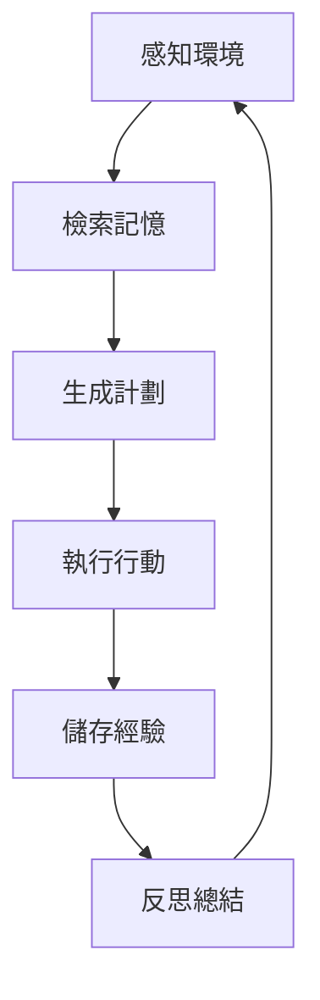

# 生成式代理系統後端架構完整指南
# Generative Agents Backend Architecture Guide (Traditional Chinese)

## 🎯 系統總覽

### 專案背景
這是將「生成式代理：人類行為的互動模擬」研究專案轉換為 Mocaverse 主題的完整技術指南。本指南將幫助您理解後端架構並進行自定義修改。

### 系統架構圖
```
┌─────────────────┐    ┌─────────────────┐
│   前端服務器    │    │   後端模擬引擎   │
│   (Django)      │◄──►│   (Python)      │
│   - 視覺化      │    │   - 代理邏輯    │
│   - 用戶界面    │    │   - 記憶系統    │
│   - 實時顯示    │    │   - LLM 整合    │
└─────────────────┘    └─────────────────┘
```

## 📁 關鍵文件結構

### 後端核心文件
```
reverie/backend_server/
├── reverie.py              # 主控制器
├── persona/
│   ├── persona.py          # 代理核心類
│   ├── cognitive_modules/  # 認知決策模組
│   ├── memory_structures/  # 記憶系統
│   └── prompt_template/    # LLM 提示模板
```

### 記憶系統文件
```
persona/memory_structures/
├── associative_memory.py   # 聯想記憶
├── spatial_memory.py       # 空間記憶
└── scratch.py             # 暫存記憶
```

## 🧠 代理認知系統詳解

### 1. 三層記憶架構

#### 1.1 聯想記憶 (Associative Memory)
- **功能**: 長期記憶儲存與檢索
- **儲存格式**: JSON 檔案結構
- **檢索方式**: 關鍵字 + 語義相似度 + 時間衰減

#### 1.2 空間記憶 (Spatial Memory)
- **功能**: 環境認知與導航
- **結構**: 樹狀空間層級
- **應用**: 路徑規劃、位置感知

#### 1.3 暫存記憶 (Scratch Memory)
- **功能**: 當前任務與短期計劃
- **生命週期**: 單次決策循環
- **內容**: 當前目標、待辦事項、對話狀態

### 2. 認知決策循環



## 🔧 LLM 整合架構

### 當前 OpenAI 架構
```python
# reverie/backend_server/utils.py
def openai_request(prompt, model="gpt-3.5-turbo"):
    response = openai.ChatCompletion.create(
        model=model,
        messages=[{"role": "user", "content": prompt}]
    )
    return response.choices[0].message.content
```

### Ollama 遷移方案
```python
# 新的 Ollama 整合
import requests

def ollama_request(prompt, model="deepseek-r1:14b"):
    response = requests.post('http://localhost:11434/api/generate', json={
        "model": model,
        "prompt": prompt,
        "stream": False
    })
    return response.json()['response']
```

### 成本分層策略
```python
# LLM 路由系統
class LLMRouter:
    def __init__(self):
        self.models = {
            'premium': 'deepseek-r1:14b',    # 複雜推理
            'standard': 'gemma2:9b',         # 日常任務
            'fast': 'qwen2.5:14b'            # 簡單回應
        }
    
    def route_request(self, task_type, complexity):
        if complexity > 0.8:
            return self.models['premium']
        elif complexity > 0.4:
            return self.models['standard']
        else:
            return self.models['fast']
```

## 🎭 角色自定義系統

### 角色配置結構
```json
// config/mocaverse_characters.json
{
  "angle": {
    "name": "Angle",
    "age": 25,
    "innate": "creative, intuitive, spiritual",
    "learned": "Angle 是一位專注於數位藝術和 NFT 的藝術家",
    "currently": "正在創作新的藝術系列",
    "lifestyle": "晚上11點睡覺，早上7點起床，上午創作",
    "sprite": "assets/characters/angle.png"
  }
}
```

### 記憶文件位置
```
storage/base_the_ville_n25/personas/
├── [character_name]/
│   ├── bootstrap_memory/
│   │   ├── associative_memory.json
│   │   ├── spatial_memory.json
│   │   └── scratch.json
│   └── daily_plan.json
```

## 🗺️ 環境編輯系統

### 地圖結構解析
```
environment/frontend_server/static_dirs/assets/the_ville/
├── matrix/              # 碰撞和導航數據
├── visuals/            # 視覺圖塊
├── collision_tiles.json # 可行走區域
└── environment.json    # 物件和互動點
```

### 地圖編輯步驟
1. **安裝 Tiled Map Editor**
2. **打開地圖文件**: `assets/the_ville/map.tmx`
3. **替換圖塊**: 將 Smallville 圖塊換成 Mocaverse 主題
4. **調整佈局**: 移動建築物和道路
5. **更新碰撞**: 重新生成 collision_tiles.json
6. **測試導航**: 驗證代理可以正確移動

## 🛠️ 實際修改步驟

### 步驟 1: LLM 提供商替換

#### 1.1 修改 utils.py
```python
# reverie/backend_server/utils.py
# 將 OpenAI 調用改為 Ollama

import requests
import json

class LLMClient:
    def __init__(self, base_url="http://localhost:11434"):
        self.base_url = base_url
        
    def generate(self, prompt, model="deepseek-r1:14b"):
        response = requests.post(f"{self.base_url}/api/generate", json={
            "model": model,
            "prompt": prompt,
            "stream": False
        })
        return response.json()['response']

# 替換所有 openai_request 調用
llm_client = LLMClient()
```

#### 1.2 更新提示模板
```python
# persona/prompt_template/run_gpt_prompt.py
# 修改所有 GPT 調用為本地模型

def run_gpt_prompt(prompt, model="deepseek-r1:14b"):
    return llm_client.generate(prompt, model)
```

### 步驟 2: 角色自定義

#### 2.1 創建角色模板
```bash
# 複製現有角色作為模板
cp -r storage/base_the_ville_n25/personas/isabella storage/base_the_ville_n25/personas/angle
```

#### 2.2 修改角色記憶
```json
// storage/base_the_ville_n25/personas/angle/bootstrap_memory/associative_memory.json
[
  {
    "node_id": "angle_001",
    "type": "thought",
    "description": "我是 Mocaverse 的 Angle，一位數位藝術家",
    "created": "2024-01-01 08:00:00",
    "poignancy": 8,
    "keywords": ["mocaverse", "artist", "digital", "nft"]
  }
]
```

### 步驟 3: 環境自定義

#### 3.1 資源替換
```bash
# 替換角色圖像
cp mocaverse_assets/characters/*.png environment/frontend_server/static_dirs/assets/characters/

# 替換環境圖塊
cp mocaverse_assets/tiles/*.png environment/frontend_server/static_dirs/assets/the_ville/visuals/
```

#### 3.2 地圖更新
```json
// environment/frontend_server/static_dirs/assets/the_ville/environment.json
{
  "locations": [
    {
      "name": "Mocaverse Gallery",
      "x": 100,
      "y": 200,
      "description": "展示數位藝術的畫廊"
    }
  ]
}
```

## 📊 性能優化 (RTX 4090)

### 模型配置建議
```bash
# 安裝推薦模型
ollama pull deepseek-r1:14b
ollama pull gemma2:9b
ollama pull qwen2.5:14b

# 測試模型
ollama run deepseek-r1:14b "你好，請介
