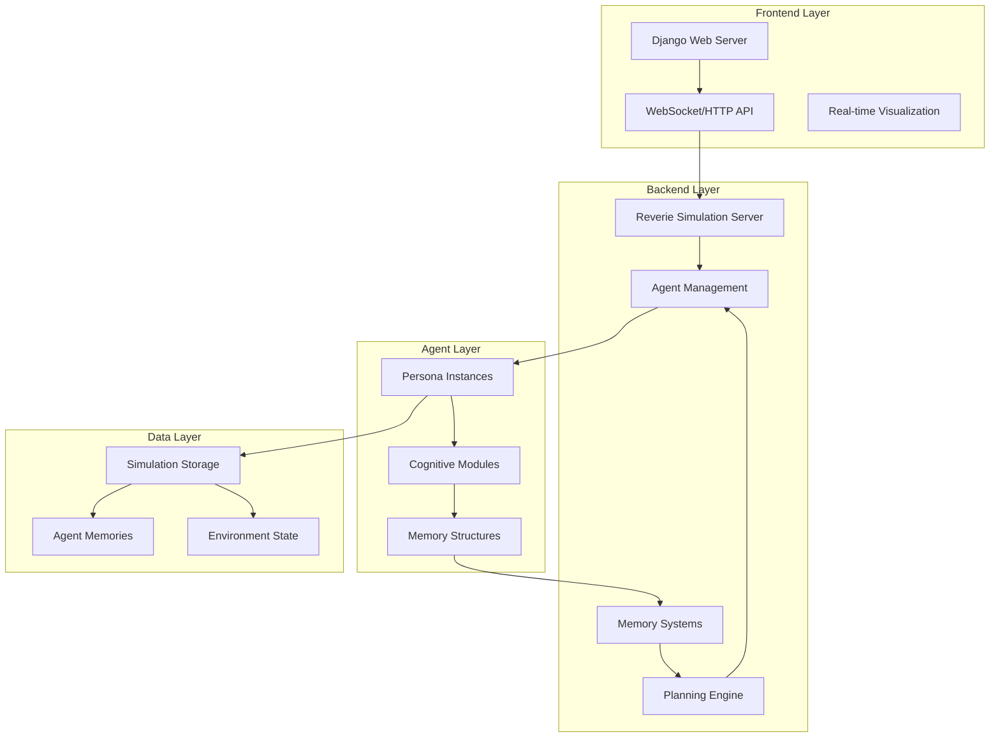
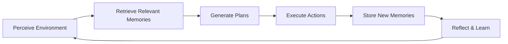
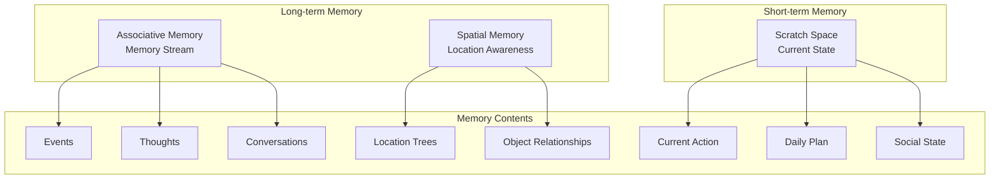
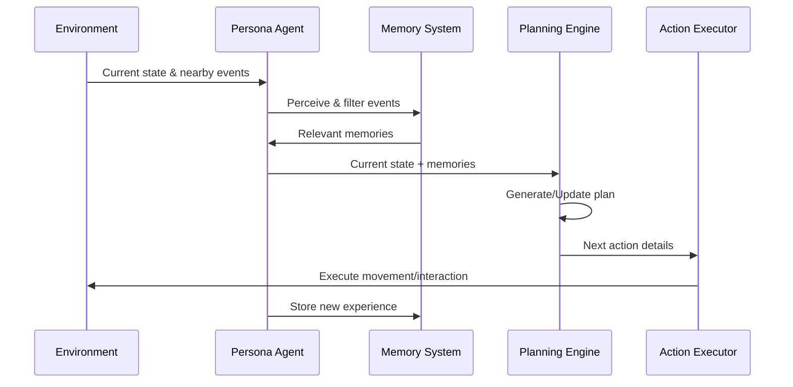
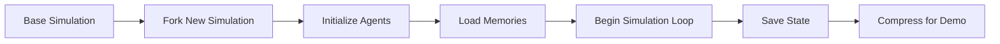
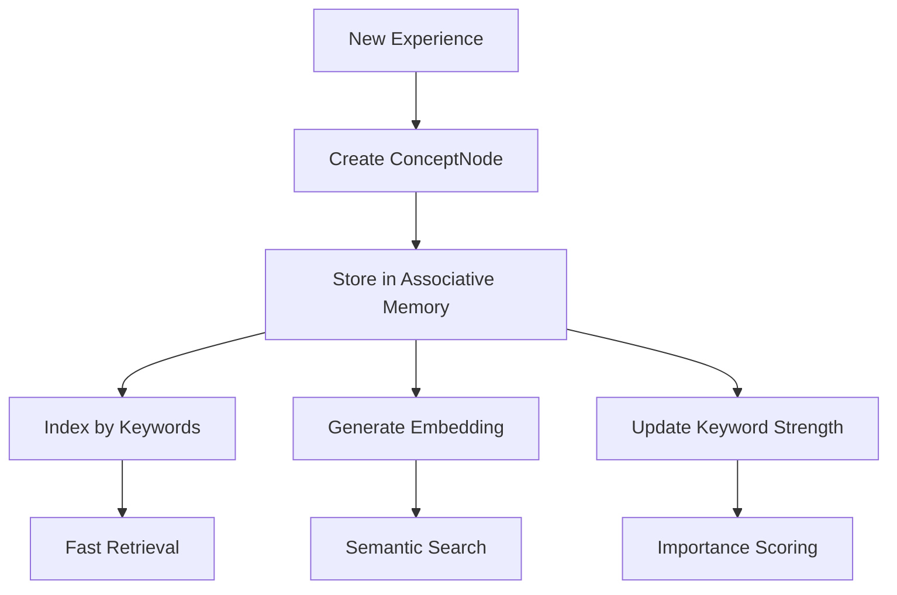

# System Patterns: Generative Agents Architecture

## High-Level Architecture

## Core System Patterns

### 1. **Two-Server Architecture Pattern**
- **Frontend Server**: Django-based web interface for visualization
- **Backend Server**: Python simulation engine for agent logic
- **Communication**: File-based state sharing and HTTP endpoints

### 2. **Agent-Centric Design Pattern**
Each agent (Persona) operates as an autonomous entity with:
- **Identity**: Unique name, age, personality traits
- **Memory**: Three-tier memory system
- **Planning**: Daily and hourly planning capabilities
- **Perception**: Environmental awareness and social perception
- **Action**: Movement and interaction capabilities

### 3. **Memory-Driven Behavior Pattern**

### 4. **Hierarchical Planning Pattern**
- **Daily Planning**: High-level daily objectives
- **Hourly Planning**: Time-blocked activities
- **Task Decomposition**: Breaking down complex activities
- **Action Execution**: Concrete movement and interaction

## Memory System Architecture

### Three-Tier Memory Structure

### Memory Retrieval Pattern
1. **Keyword-based**: Fast lookup using keyword indices
2. **Embedding-based**: Semantic similarity search
3. **Recency-weighted**: Recent memories prioritized
4. **Importance-weighted**: Significant memories prioritized

## Agent Decision-Making Flow

## Communication Patterns

### Inter-Agent Communication
- **Direct Conversation**: When agents are co-located
- **Memory Influence**: Shared experiences affect future behaviors
- **Social Network**: Relationships form through repeated interactions

### Server Communication
- **State Synchronization**: Backend writes state files, frontend reads
- **Command Interface**: CLI-based simulation control
- **Real-time Updates**: WebSocket-like polling for visualization

## Data Flow Patterns

### Simulation State Flow

### Memory Data Flow

## Scalability Patterns

### Agent Management
- **Lazy Loading**: Agents initialized on-demand
- **Memory Optimization**: Compressed storage for long-term memories
- **Parallel Processing**: Independent agent decision-making
- **State Checkpointing**: Regular saves for crash recovery

### Performance Optimization
- **Caching**: Keyword and embedding caches
- **Batch Processing**: Group operations where possible
- **Selective Attention**: Limited perception bandwidth
- **Memory Pruning**: Forgetting less important information

## Error Handling Patterns

### Graceful Degradation
- **API Failures**: Fallback to cached responses
- **Memory Corruption**: Bootstrap from base simulation
- **Network Issues**: Local file-based state management
- **Resource Limits**: Automatic memory cleanup

### Recovery Mechanisms
- **Checkpoint System**: Regular state snapshots
- **Incremental Saves**: Minimize data loss
- **Validation**: Memory integrity checks
- **Rollback**: Revert to last known good state
