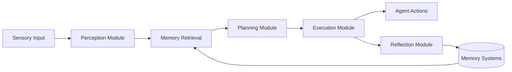

# Technical Context - Generative Agents

## Technology Stack

### Core Technologies
- **Python 3.8+**: Primary programming language
- **Django 4.x**: Web framework for frontend server
- **OpenAI API**: Language model for agent cognition
- **NumPy**: Numerical computations and vector operations
- **JSON**: Data serialization and storage format
- **CSV**: Environment map data format

### Dependencies
```python
# Core Requirements
Django>=4.0
openai>=0.27.0
numpy>=1.21.0
python-dotenv>=0.19.0
requests>=2.28.0

# Development Tools
pytest>=7.0.0
black>=22.0.0
flake8>=4.0.0
```

### External Services
- **OpenAI API**: Required for GPT-3.5/GPT-4 text generation
- **OpenAI Embeddings**: For semantic similarity in memory retrieval
- **Browser**: Web interface for simulation visualization

## Installation & Setup

### Quick Start
1. **Clone Repository**
   ```bash
   git clone https://github.com/joonspk-research/generative_agents.git
   cd generative_agents
   ```

2. **Install Dependencies**
   ```bash
   pip install -r requirements.txt
   ```

3. **Configure OpenAI API**
   ```bash
   # Create .env file in root directory
   echo "OPENAI_API_KEY=your_api_key_here" > .env
   ```

4. **Start Environment Server**
   ```bash
   cd environment/frontend_server
   python manage.py runserver
   ```

5. **Start Simulation Server**
   ```bash
   # In new terminal
   cd reverie/backend_server
   python reverie.py
   ```

### Directory Structure
```
generative_agents/
├── environment/                 # Frontend visualization
│   └── frontend_server/        # Django web application
│       ├── static_dirs/         # Static assets (CSS, images, sprites)
│       ├── storage/             # Simulation data storage
│       ├── templates/           # HTML templates
│       └── translator/          # Django app for data handling
├── reverie/                     # Backend simulation engine
│   └── backend_server/          # Core simulation logic
│       ├── persona/             # Agent cognitive architecture
│       │   ├── cognitive_modules/    # Perception, planning, reflection
│       │   ├── memory_structures/    # Memory management systems
│       │   └── prompt_template/      # LLM prompt engineering
│       ├── maze.py              # World/environment system
│       ├── reverie.py           # Main simulation server
│       └── path_finder.py       # Agent movement pathfinding
└── requirements.txt             # Python dependencies
```

## Core APIs & Interfaces

### Simulation Control API
**Endpoint**: `reverie.py` command-line interface

**Key Functions**:
```python
# Start new simulation
start_simulation(sim_code, step, time_step)

# Save simulation state  
save_to_json(sim_code, step, time_step)

# Load existing simulation
load_from_json(sim_code, step)

# Execute simulation steps
run_simulation(sim_code, num_steps)
```

### Frontend API Endpoints
**Base URL**: `http://localhost:8000/`

**Key Routes**:
- `/`: Main simulation viewer
- `/demo/`: Demo interface with simulation controls
- `/persona_state/<name>/`: Individual agent state viewer
- `/path_tester/`: Movement pathfinding tester

### Memory System APIs
**Associative Memory**:
```python
# Add new memory node
add_event(created, expiration, s, p, o, description, keywords, poignancy, embedding_pair, filling)

# Retrieve relevant memories
retrieve(focal_points, n_count=30)

# Get recent memory summary
get_summarized_latest_events(retention)
```

**Spatial Memory**:
```python
# Update world knowledge
add_game_object(address, game_object)

# Check location accessibility  
get_str_accessible_arena_game_objects(arena_address)
```

## Model Architecture Details

### Agent Cognitive Pipeline


### Memory Node Structure
```json
{
  "node_id": "node_1",
  "node_count": 1,
  "type_count": 1,
  "type": "event",
  "depth": 1,
  "created": "2023-02-13 08:00:00",
  "expiration": "2023-03-15 08:00:00",
  "subject": "Isabella Rodriguez",
  "predicate": "is",
  "object": "opening Hobbs Cafe",
  "description": "Isabella Rodriguez is opening Hobbs Cafe",
  "embedding_key": "Isabella Rodriguez is opening Hobbs Cafe",
  "poignancy": 4,
  "keywords": ["Isabella Rodriguez", "opening", "Hobbs Cafe"],
  "filling": [node_references]
}
```

### Persona Configuration Schema
```json
{
  "name": "Isabella Rodriguez",
  "age": 34,
  "innate": "friendly, outgoing, hospitable",
  "learned": "cafe owner who loves making people feel welcome",
  "currently": "planning a Valentine's Day party",
  "lifestyle": "goes to bed around 11pm, wakes up around 6am",
  "living_area": "the Ville:Isabella Rodriguez's apartment:main room",
  "daily_plan_req": "opens Hobbs Cafe at 8am, works until 8pm",
  "vision_r": 8,
  "att_bandwidth": 8,
  "retention": 8
}
```

## Environment System

### World Map Format
**Tile System**: 2D matrix of dictionaries, each containing:
```python
{
  "world": "the Ville",
  "sector": "Hobbs Cafe", 
  "arena": "main room",
  "game_object": "coffee machine",
  "spawning_location": "cafe-counter-a",
  "collision": False,
  "events": set()
}
```

**Map Files** (CSV format):
- `collision_maze.csv`: Walkable/blocked tiles
- `sector_maze.csv`: Area definitions  
- `arena_maze.csv`: Room boundaries
- `game_object_maze.csv`: Interactive objects
- `spawning_location_maze.csv`: Agent spawn points

### Address System
**Hierarchical Format**: `world:sector:arena:game_object`
**Examples**:
- `the Ville:Hobbs Cafe:main room:coffee machine`
- `the Ville:Isabella Rodriguez's apartment:main room`
- `<spawn_loc>cafe-counter-a` (special spawning locations)

## Configuration Options

### Cognitive Parameters
```python
# Memory weights for retrieval scoring
"recency_w": 1,          # Weight for recency scoring
"relevance_w": 1,        # Weight for relevance scoring  
"importance_w": 1,       # Weight for importance scoring
"recency_decay": 0.995,  # Decay rate for recency

# Reflection triggers
"importance_trigger_max": 150,  # Max importance before reflection
"daily_reflection_time": 180,   # Minutes per day for reflection
"daily_reflection_size": 5,     # Number of insights per reflection

# Memory management
"concept_forget": 100,           # Forgetting mechanism threshold
"overlap_reflect_th": 4,         # Reflection overlap threshold
"kw_strg_event_reflect_th": 10,  # Event keyword strength threshold
"kw_strg_thought_reflect_th": 9  # Thought keyword strength threshold
```

### Simulation Parameters
```python
# Time progression
"step_size": 10,         # Minutes per simulation step
"start_time": "08:00",   # Simulation start time
"end_time": "23:00",     # Daily simulation end time

# Agent behavior
"vision_r": 8,           # Vision radius in tiles
"att_bandwidth": 8,      # Attention bandwidth for events
"retention": 8           # Number of recent events to consider
```

## Critical Files for Customization

### Environment Reskinning
**Visual Assets**:
- `environment/frontend_server/static_dirs/assets/the_ville/` - World tiles and backgrounds
- `environment/frontend_server/static_dirs/assets/characters/` - Character sprites
- `environment/frontend_server/static_dirs/css/style.css` - UI styling

**Map Data**:
- `environment/frontend_server/storage/[ENV_NAME]/environment/` - Map matrix files
- `reverie/backend_server/maze_assets/` - Map metadata and block definitions

**Key Files to Modify**:
1. `maze_meta_info.json` - World dimensions and constraints
2. `special_blocks/*.csv` - Location and object definitions
3. `maze/*.csv` - Tile matrix data for collision, sectors, arenas, objects

### Character Replacement
**Persona Data**:
- `environment/frontend_server/storage/[ENV_NAME]/personas/[NAME]/bootstrap_memory/scratch.json` - Core identity
- `environment/frontend_server/storage/[ENV_NAME]/personas/[NAME]/bootstrap_memory/spatial_memory.json` - World knowledge
- `environment/frontend_server/storage/[ENV_NAME]/personas/[NAME]/bootstrap_memory/associative_memory/` - Background memories

**Character Assets**:
- `environment/frontend_server/static_dirs/assets/characters/[NAME]/` - Sprite images

**Key Customization Areas**:
1. **Identity**: Edit `innate`, `learned`, `currently` fields in scratch.json
2. **Daily Routine**: Modify `daily_plan_req` and `lifestyle` 
3. **Relationships**: Initialize associative memory with character connections
4. **Memories**: Edit `nodes.json` to add background experiences
5. **Appearance**: Replace character sprite images

### Persona Editing Process
1. **Create New Persona Folder**: Copy existing persona structure
2. **Edit Core Identity**: Modify scratch.json with new personality traits
3. **Customize Memories**: Add relevant background memories to associative_memory/
4. **Set Relationships**: Include memories referencing other characters
5. **Update Spatial Knowledge**: Ensure persona knows relevant world locations
6. **Add Visual Assets**: Include character sprites in assets folder

## Development Guidelines

### Code Organization
- **Cognitive Modules**: Separate files for each mental process (perceive, plan, reflect)
- **Memory Systems**: Isolated memory types with clean interfaces
- **Prompt Engineering**: Centralized LLM prompts in `prompt_template/`
- **Data Persistence**: JSON-based storage with clear schema definitions

### Testing Approach
- **Unit Tests**: Test individual cognitive modules
- **Integration Tests**: Test agent-environment interactions
- **Simulation Tests**: Validate long-running simulation stability
- **Performance Tests**: Monitor memory usage and LLM call frequency

### Performance Considerations
- **LLM Call Optimization**: Cache responses, batch similar requests
- **Memory Management**: Implement forgetting mechanisms for long simulations
- **Spatial Optimization**: Use efficient data structures for pathfinding
- **Storage Efficiency**: Compress historical simulation data

### Extension Points
- **New Cognitive Modules**: Add modules following existing interface patterns
- **Custom Memory Types**: Implement specialized memory structures
- **Alternative LLMs**: Replace OpenAI API with other language models
- **Enhanced Environments**: Support 3D worlds or multiple connected areas

## API Rate Limits & Costs

### OpenAI API Usage
- **Text Generation**: GPT-3.5-turbo or GPT-4 for agent cognition
- **Embeddings**: text-embedding-ada-002 for memory similarity
- **Estimated Costs**: $0.10-$1.00 per hour per agent (depending on model)
- **Rate Limits**: 3,500 requests/minute for GPT-3.5-turbo

### Optimization Strategies
- **Prompt Caching**: Store and reuse similar prompt responses
- **Batch Processing**: Group multiple agent decisions
- **Smart Triggering**: Only call LLM when necessary
- **Model Selection**: Use appropriate model size for each task

## Deployment Options

### Local Development
- **Requirements**: Python 3.8+, 8GB RAM, OpenAI API key
- **Performance**: Supports 3-5 agents on standard laptop
- **Storage**: 1-2GB for typical simulation runs

### Production Deployment
- **Server Requirements**: 16GB+ RAM, multi-core CPU for 10+ agents
- **Database**: Consider PostgreSQL for production memory storage
- **Caching**: Redis for prompt response caching
- **Monitoring**: Track LLM usage and simulation performance

This technical documentation provides the foundation for understanding, deploying, and customizing the Generative Agents system for various research and development applications.
