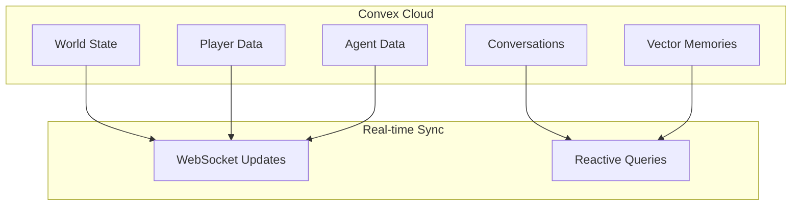
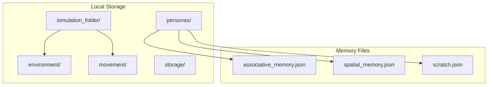

# AI Town vs Generative Agents: Backend Architecture Comparison

## Overview

This guide compares two fundamentally different approaches to building AI agent simulations:

- **AI Town**: Modern web-first game platform with real-time multiplayer capabilities
- **Generative Agents**: Academic research simulation with deep agent psychology

## Architecture Philosophy Comparison

### AI Town: Game Platform Approach
```
🎮 GAME-FIRST DESIGN
├── Real-time multiplayer experience
├── Web-native architecture
├── Production-ready deployment
├── Simplified agent behaviors
└── Horizontal scalability
```

**Philosophy**: "Build a game where humans and AI agents interact in real-time"

### Generative Agents: Research Simulation Approach
```
🔬 RESEARCH-FIRST DESIGN
├── Deep agent psychology simulation
├── Academic reproducibility
├── Local development focus
├── Complex memory systems
└── Behavioral authenticity
```

**Philosophy**: "Simulate believable human behavior for research purposes"

## Technical Stack Breakdown

### AI Town Stack
```typescript
// Modern Web Stack
Frontend: React + TypeScript + PixiJS
Backend: Convex (Serverless TypeScript)
Database: Convex NoSQL + Vector Search
Real-time: WebSocket (built-in)
Deployment: Vercel + Convex Cloud
AI: Multiple providers (Ollama, OpenAI, Together.ai)
```

**Characteristics**:
- ✅ Cloud-native and scalable
- ✅ Real-time synchronization
- ✅ Type-safe throughout
- ✅ Modern development experience
- ❌ Vendor lock-in to Convex
- ❌ Limited to in-memory game state

### Generative Agents Stack
```python
# Academic Research Stack
Frontend: Django + JavaScript
Backend: Python 3.9 + Custom Server
Database: SQLite + JSON files
Communication: File-based I/O
Deployment: Local development
AI: OpenAI GPT focused
```

**Characteristics**:
- ✅ Full control over implementation
- ✅ Rich memory systems
- ✅ Academic reproducibility
- ✅ Deep agent behaviors
- ❌ Single-instance limitation
- ❌ Manual scaling required

## Data Architecture Comparison

### AI Town: Cloud Database Approach


**Benefits**:
- Automatic synchronization
- Built-in vector search
- ACID guarantees
- Horizontal scaling

### Generative Agents: File-based Approach


**Benefits**:
- Full data control
- Easy debugging
- Reproducible experiments
- No external dependencies

## Memory System Architecture

### AI Town: Simple Vector Memory
```typescript
interface AgentMemory {
  // Simple vector-based memory
  embeddings: number[][];
  importance: number[];
  recency: number[];
  
  // Built-in similarity search
  retrieve(query: string): Memory[];
}
```

**Characteristics**:
- Lightweight and fast
- Built-in vector search
- Automatic relevance scoring
- Limited complexity

### Generative Agents: Three-Tier Memory System
```python
class Persona:
    # Complex memory architecture
    a_mem: AssociativeMemory    # Long-term event storage
    s_mem: SpatialMemory       # Location awareness
    scratch: Scratch           # Current state
    
    # Rich memory nodes
    class ConceptNode:
        description: str
        embedding: List[float]
        keywords: Set[str]
        poignancy: int         # Importance score
        created: datetime
        last_accessed: datetime
```

**Characteristics**:
- Rich memory structures
- Multiple memory types
- Detailed metadata
- Research-grade complexity

## Communication Patterns

### AI Town: Real-time Reactive
```typescript
// Frontend automatically updates when backend changes
const world = useQuery(api.game.main.worldStatus, { worldId });

// Immediate mutations with optimistic updates
const sendInput = useMutation(api.game.main.sendInput);
await sendInput({ 
  name: 'moveTo', 
  args: { destination: { x, y } } 
});

// Streaming LLM responses
const conversation = useQuery(api.messages.list, { conversationId });
```

### Generative Agents: File-based Polling
```python
# Backend writes state files
curr_env_file = f"{sim_folder}/environment/{self.step}.json"
with open(curr_env_file, "w") as outfile:
    outfile.write(json.dumps(environment_state, indent=2))

# Frontend polls for file changes
def check_for_updates():
    if check_if_file_exists(curr_env_file):
        with open(curr_env_file) as json_file:
            new_env = json.load(json_file)
        return new_env
```

## Game Loop Architecture

### AI Town: Tick-based with Batching
```typescript
class AbstractGame {
  // High-frequency simulation (60 FPS)
  tick(now: number): void {
    this.processInputs();
    this.updateAgents();
    this.updatePhysics();
  }
  
  // Low-frequency persistence (1 Hz)
  saveStep(): GameStateDiff {
    return this.generateStateDiff();
  }
}
```

**Flow**:
1. 60 FPS ticks for smooth gameplay
2. 1 Hz database saves for efficiency
3. Historical interpolation for movement
4. Async LLM operations don't block

### Generative Agents: Step-based Simulation
```python
class ReverieServer:
    def start_server(self, int_counter):
        while int_counter > 0:
            # Wait for frontend environment file
            if check_if_file_exists(curr_env_file):
                # Process all agents synchronously
                for persona in self.personas.values():
                    next_tile, desc = persona.move(...)
                
                # Save movement file for frontend
                with open(curr_move_file, "w") as outfile:
                    outfile.write(json.dumps(movements))
                
                int_counter -= 1
```

**Flow**:
1. Step-by-step simulation
2. Synchronous agent processing
3. File-based frontend communication
4. Manual step control

## Scalability Comparison

### AI Town: Horizontal Scaling
```
Single World Limits:
├── ~few dozen KB game state (in-memory)
├── ~50-100 concurrent players
├── ~10-20 AI agents per world
└── Multiple worlds can run simultaneously

Scaling Strategy:
├── Convex handles database scaling
├── Multiple world instances
├── Cloud-native architecture
└── Automatic load balancing
```

### Generative Agents: Vertical Scaling
```
Single Instance Limits:
├── 25+ agents maximum
├── 2-4GB RAM requirement
├── Single simulation per server
└── Local storage constraints

Scaling Strategy:
├── More powerful hardware
├── Memory optimization
├── Simulation checkpointing
└── Manual instance management
```

## Development Experience

### AI Town Development Flow
```bash
# Modern development setup
npm install
npm run dev

# Real-time development
- Hot reload for frontend
- Automatic backend deployment
- Built-in debugging tools
- Type safety throughout
```

### Generative Agents Development Flow
```bash
# Research-oriented setup
pip install -r requirements.txt
python manage.py runserver  # Frontend
python reverie.py          # Backend

# CLI-based interaction
> run 100                  # Run 100 steps
> print persona schedule Isabella Rodriguez
> save                     # Manual save
```

## Use Case Scenarios

### Choose AI Town When:
- ✅ Building multiplayer experiences
- ✅ Need real-time interactions
- ✅ Want modern web deployment
- ✅ Prioritize user experience
- ✅ Need horizontal scaling
- ✅ Building commercial products

### Choose Generative Agents When:
- ✅ Conducting AI research
- ✅ Need deep agent psychology
- ✅ Want full control over implementation
- ✅ Studying agent behaviors
- ✅ Academic reproducibility required
- ✅ Building simulation experiments

## Migration Considerations

### From Generative Agents to AI Town
**Challenges**:
- Simplify complex memory systems
- Adapt to real-time constraints
- Redesign for multiplayer
- Convert Python logic to TypeScript

**Benefits**:
- Gain real-time capabilities
- Automatic scaling
- Modern deployment
- Better user experience

### From AI Town to Generative Agents
**Challenges**:
- Lose real-time synchronization
- Manual scaling required
- Local deployment only
- File-based architecture

**Benefits**:
- Deeper agent behaviors
- Full implementation control
- Rich memory systems
- Research capabilities

## Hybrid Approach Possibilities

### Combining Best of Both
```
Potential Architecture:
├── AI Town's real-time infrastructure
├── Generative Agents' memory systems
├── Microservices for agent processing
├── Event-driven architecture
└── Configurable complexity levels
```

**Implementation Strategy**:
1. Use Convex for real-time sync
2. Implement rich memory as separate service
3. Async agent processing pipeline
4. Configurable agent complexity
5. Research mode vs Game mode

## Key Takeaways

### Fundamental Differences
1. **Purpose**: Game platform vs Research simulation
2. **Architecture**: Cloud-native vs Local file-based
3. **Scaling**: Horizontal vs Vertical
4. **Complexity**: Simple vs Deep
5. **Deployment**: Production vs Academic

### Decision Framework
```
Choose based on:
├── Primary use case (Game vs Research)
├── Scaling requirements (Many users vs Deep agents)
├── Development resources (Modern vs Custom)
├── Deployment needs (Cloud vs Local)
└── Complexity requirements (Simple vs Rich)
```

### Future Considerations
- **Convergence**: Both approaches may evolve toward each other
- **Hybrid Solutions**: Combining real-time with deep psychology
- **Standardization**: Common interfaces for agent behaviors
- **Tooling**: Better development tools for both approaches

This comparison shows that while both projects simulate AI agents, they represent completely different architectural philosophies optimized for different goals. Understanding these differences is crucial for choosing the right approach for your specific use case.
