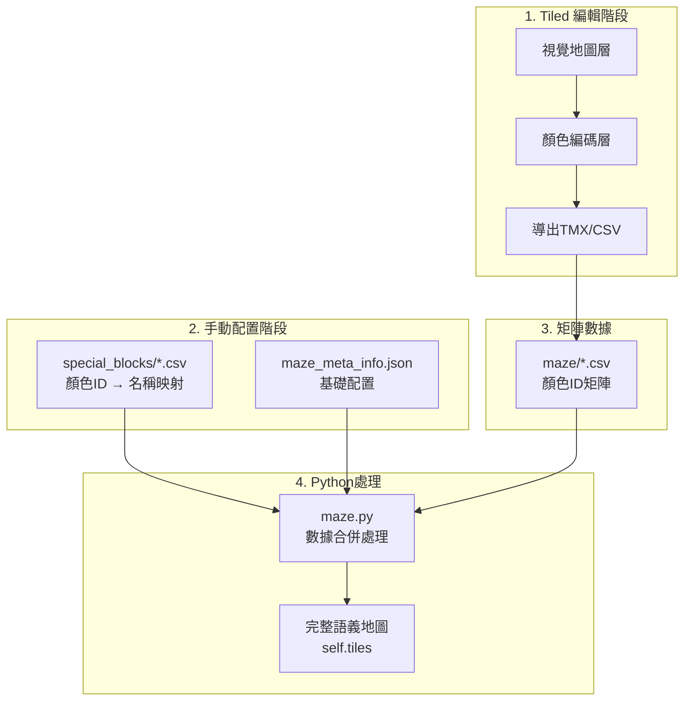
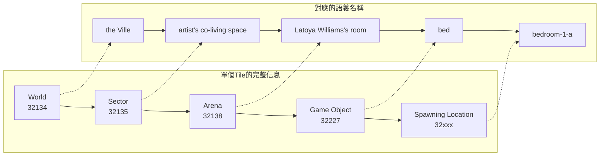
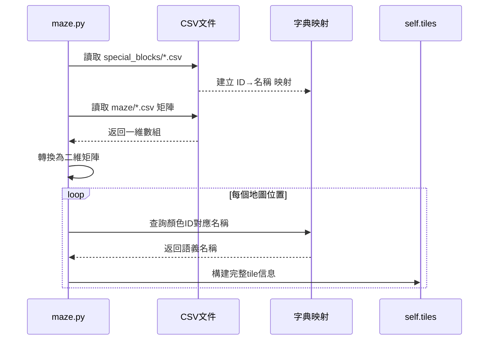
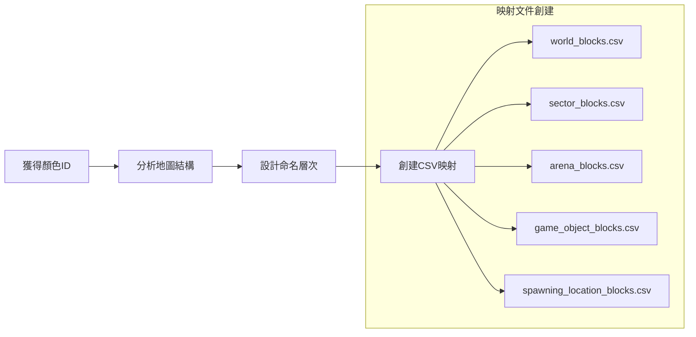
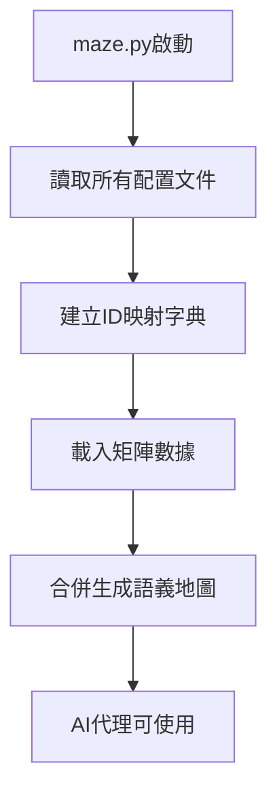
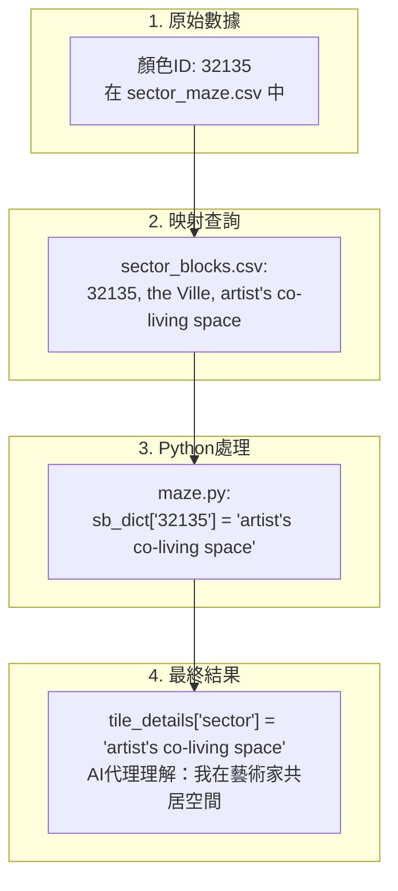
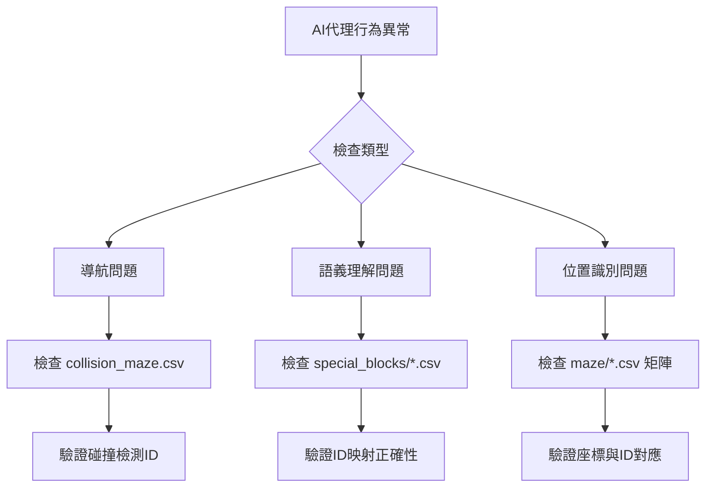

# 🎨 顏色ID系統完整指南

## 📖 概述

在 Generative Agents 項目中，地圖系統使用了一個精密的**顏色ID編碼系統**來實現從視覺地圖到AI代理語義理解的轉換。這個系統是整個項目中最複雜但也最關鍵的部分之一。

### 🤔 為什麼需要顏色ID系統？

AI代理需要理解：
- 「我現在在哪裡？」→ `"the Ville:artist's co-living space:Latoya Williams's room"`
- 「床在哪裡？」→ `"the Ville:artist's co-living space:Latoya Williams's room:bed"`
- 「我可以走到廚房嗎？」→ 路徑規劃需要碰撞檢測

但 Tiled Map Editor 只能提供：
- 視覺圖片（PNG）
- 基礎圖層信息（TMX）

**顏色ID系統** 就是連接兩者的橋樑！

---

## 🔧 技術原理

### 系統架構圖



### 五層地圖系統

每個地圖位置包含5層信息：



---

## 📂 文件結構詳解

### 核心文件組織

```
environment/frontend_server/static_dirs/assets/the_ville/matrix/
├── maze_meta_info.json          # 基礎元數據
├── special_blocks/              # 🔑 顏色ID映射表
│   ├── world_blocks.csv         # 世界層映射
│   ├── sector_blocks.csv        # 區域層映射  
│   ├── arena_blocks.csv         # 場所層映射
│   ├── game_object_blocks.csv   # 物件層映射
│   └── spawning_location_blocks.csv # 生成點映射
└── maze/                        # 🗺️ 顏色ID矩陣
    ├── collision_maze.csv       # 碰撞檢測矩陣
    ├── sector_maze.csv          # 區域矩陣
    ├── arena_maze.csv           # 場所矩陣
    ├── game_object_maze.csv     # 物件矩陣
    └── spawning_location_maze.csv # 生成點矩陣
```

### 實際數據示例

#### special_blocks/world_blocks.csv
```csv
32134, the Ville
```

#### special_blocks/sector_blocks.csv
```csv
32135, the Ville, artist's co-living space
32145, the Ville, Arthur Burton's apartment
32155, the Ville, Ryan Park's apartment
32165, the Ville, Isabella Rodriguez's apartment
...
```

#### maze/sector_maze.csv（部分）
```csv
0, 0, 0, 0, 0, 0, ..., 32135, 32135, 32135, ..., 32145, 32145, 32145, ...
```

---

## ⚙️ maze.py 處理流程

### 數據載入與處理



### 核心代碼邏輯

```python
# 1. 建立映射字典
sb_rows = read_file_to_list("sector_blocks.csv", header=False)
sb_dict = dict()
for i in sb_rows: 
    sb_dict[i[0]] = i[-1]  # "32135" → "artist's co-living space"

# 2. 處理矩陣數據  
sector_maze_raw = read_file_to_list("sector_maze.csv", header=False)[0]
# 轉換為二維矩陣
for i in range(0, len(sector_maze_raw), maze_width): 
    sector_maze += [sector_maze_raw[i:i+maze_width]]

# 3. 合併信息
for i in range(maze_height):
    for j in range(maze_width):
        tile_details = dict()
        tile_details["world"] = "the Ville"
        
        # 查詢sector信息
        if sector_maze[i][j] in sb_dict: 
            tile_details["sector"] = sb_dict[sector_maze[i][j]]
        
        # ... 其他層級類似處理
        self.tiles[i][j] = tile_details
```

---

## 🛠️ 完整工作流程

### 步驟1: Tiled中的顏色編碼

```mermaid
graph TD
    A[打開Tiled Map Editor] --> B[創建新圖層 'ColorCoding']
    B --> C[選擇畫筆工具]
    C --> D[為不同區域選擇特定顏色]
    D --> E[顏色示例:<br/>RGB(125,50,134) → 32134<br/>RGB(125,50,135) → 32135]
    E --> F[導出為CSV格式]
```

### 步驟2: 手動創建映射文件



### 步驟3: 系統自動處理



---

## 💡 實際案例分析

### 案例：32135 的完整處理流程



### 數據流向圖

```mermaid
sankey
    32134 [顏色ID] >> 100 >> the Ville [World]
    32135 [顏色ID] >> 80 >> artist's co-living space [Sector]  
    32138 [顏色ID] >> 60 >> Latoya Williams's room [Arena]
    32227 [顏色ID] >> 40 >> bed [Game Object]
    32xxx [顏色ID] >> 20 >> bedroom-1-a [Spawn Location]
    
    the Ville [World] >> 100 >> Complete Tile [最終語義]
    artist's co-living space [Sector] >> 80 >> Complete Tile [最終語義]
    Latoya Williams's room [Arena] >> 60 >> Complete Tile [最終語義] 
    bed [Game Object] >> 40 >> Complete Tile [最終語義]
    bedroom-1-a [Spawn Location] >> 20 >> Complete Tile [最終語義]
```

---

## 🔍 調試與維護

### 常見問題診斷



### 維護檢查清單

1. **文件完整性檢查**
   - ✅ 所有 CSV 文件存在且可讀
   - ✅ 矩陣尺寸與 maze_meta_info.json 一致
   - ✅ 所有使用的顏色ID都有對應映射

2. **數據一致性檢查**
   - ✅ 同一物件在不同文件中命名一致
   - ✅ 層次結構邏輯正確（World→Sector→Arena→Object）
   - ✅ 沒有重複的顏色ID

3. **功能性測試**
   - ✅ AI代理能正確理解位置
   - ✅ 路徑規劃功能正常
   - ✅ 碰撞檢測準確

---

## 📊 性能考量

### 數據量估算


### 載入時間分析

| 操作步驟 | 預估時間 | 說明 |
|---------|---------|------|
| CSV文件讀取 | <10ms | 5個mapping文件 + 5個矩陣文件 |
| 字典建立 | <5ms | 構建ID映射字典 |
| 矩陣轉換 | <20ms | 一維轉二維，2800個位置 |
| 語義合併 | <50ms | 每個tile查詢5層信息 |
| **總計** | **<100ms** | 整個地圖載入完成 |

---

## 🔮 擴展指南

### 添加新區域的步驟

1. **選擇新的顏色ID範圍**
   ```
   已使用: 32134-32300
   新區域: 32301-32400 (預留100個ID)
   ```

2. **更新所有相關文件**
   - 添加到適當的 special_blocks/*.csv
   - 在 Tiled 中使用對應顏色標記
   - 重新導出矩陣文件

3. **測試驗證**
   - 運行 maze.py 測試載入
   - 驗證AI代理能正確識別新區域

### 最佳實踐建議

- 🎯 **顏色ID命名規則**: 按功能區塊分配ID範圍
- 📋 **文檔維護**: 保持ID分配記錄表
- 🔄 **版本控制**: 重要更改前備份所有配置文件
- ✅ **測試流程**: 每次修改後完整測試AI代理行為

---

## 🎯 總結

顏色ID系統雖然複雜，但它巧妙地解決了**視覺地圖**與**AI語義理解**之間的鴻溝：

1. **Tiled** 提供直觀的視覺編輯能力
2. **顏色編碼** 提供機器可讀的結構化數據  
3. **maze.py** 自動合併生成AI可理解的語義地圖
4. **AI代理** 獲得完整的空間感知能力

理解了這個系統，你就掌握了 Generative Agents 項目的核心技術架構！

---

*📅 創建時間: 2025年1月8日*  
*🔗 相關文檔: [[map-editing-workflow]], [[generative-agents-workflow]]*
