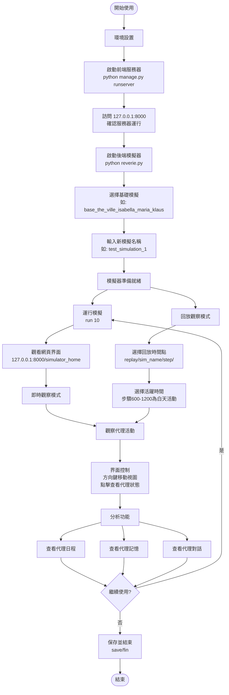

# 生成式代理項目完整用戶流程

本文檔詳細說明生成式代理（Generative Agents）項目的完整使用流程，從環境設置到模擬觀看的所有步驟。

## 🔄 完整用戶流程圖



## 📋 詳細操作步驟

### 🚀 1. 環境設置階段

#### 前端服務器啟動：
```bash
cd environment/frontend_server
python manage.py runserver
```

#### 後端模擬器啟動：
```bash
cd reverie/backend_server  
python reverie.py
```

#### 驗證服務器狀態：
- 訪問 `http://127.0.0.1:8000/` 確認前端運行
- 應該看到"環境服務器已啟動"的提示

### 🎮 2. 模擬設置階段

#### 選擇基礎場景：
- `base_the_ville_isabella_maria_klaus` - 3個代理的小鎮場景
- `base_the_ville_n25` - 25個代理的大型場景

#### 創建新模擬：
- 輸入自定義模擬名稱，如：`my_simulation_test`
- 系統會基於基礎場景創建新的模擬實例

### ⚡ 3. 模擬運行階段

#### 基本命令：
- `run [數字]` - 運行指定步數的模擬
- `run 10` - 運行10步（約2-3分鐘遊戲時間）
- `run 100` - 運行100步（約20-30分鐘遊戲時間）

#### 實時觀察：
- 訪問 `http://127.0.0.1:8000/simulator_home`
- 觀察虛擬地圖上代理的實時移動和活動

### 📹 4. 回放觀看階段

#### 回放URL格式：
```
http://127.0.0.1:8000/replay/[模擬名稱]/[步驟]/
http://127.0.0.1:8000/demo/[模擬名稱]/[步驟]/[速度]/
```

#### 實際範例：
```
http://127.0.0.1:8000/replay/July1_the_ville_isabella_maria_klaus-step-3-10/800/
http://127.0.0.1:8000/demo/test_simulation_1/600/2/
```

### ⏰ 5. 時間和活躍度管理

#### 時間對應表：
| 步驟範圍 | 遊戲時間 | 代理活躍度 | 建議觀看 |
|---------|----------|-----------|----------|
| 0-200   | 深夜0-6點 | 睡眠 | ❌ |
| 200-600 | 早晨6-10點 | 起床活動 | ✅ |
| 600-900 | 白天10-15點 | 工作社交 | ✅✅ |
| 900-1200 | 下午15-20點 | 社交晚餐 | ✅✅ |
| 1200+ | 晚上20點+ | 休息娛樂 | ✅ |

### 🎛️ 6. 界面控制操作

#### 基本控制：
- **方向鍵** ↑↓←→ - 移動地圖視圖
- **滑鼠點擊代理** - 查看代理詳細狀態
- **滑鼠滾輪** - 縮放地圖（如果支持）

#### 代理資訊查看：
- **當前活動** - 代理正在做什麼
- **位置信息** - 代理的具體位置
- **狀態歷史** - 代理的行動歷史記錄
- **對話記錄** - 代理之間的交流內容

### 💾 7. 數據存儲位置

#### 模擬數據存放：
```
environment/frontend_server/storage/
├── [模擬名稱]/
│   ├── environment/    (環境狀態)
│   ├── movement/       (移動數據)
│   ├── personas/       (代理數據)
│   └── reverie/        (元數據)
```

#### 回放檢查：
- 查看 `movement/` 資料夾中的 .json 檔案數量
- 檔案越多表示可回放內容越豐富

### 🔧 8. 常見操作技巧

#### 找到活躍時間：
1. 如果代理都在睡覺，嘗試步驟600-1200
2. 使用Demo模式可以控制播放速度
3. 觀察不同角色的日程差異

#### 最佳觀看建議：
- **新用戶**：從步驟800開始觀看（午餐時間）
- **社交互動**：步驟1000-1200（晚餐社交）
- **工作場景**：步驟600-900（白天工作）

### ⚠️ 注意事項

1. **服務器順序**：必須先啟動前端，再啟動後端
2. **模擬命名**：避免使用特殊字符和空格
3. **步數規劃**：每步約10-15秒遊戲時間
4. **資源消耗**：長時間運行會產生大量數據文件

### 🏁 結束和保存

#### 模擬結束：
- 在後端控制台輸入 `save` 保存當前狀態
- 輸入 `fin` 結束當前模擬
- 關閉前端和後端服務器

#### 數據備份：
- 重要模擬可以複製整個storage資料夾
- 壓縮後的模擬存儲在 `compressed_storage/` 中

---

*本文檔更新於2025年1月8日，基於實際使用經驗整理。如有疑問請參考其他用戶指南文檔。*
