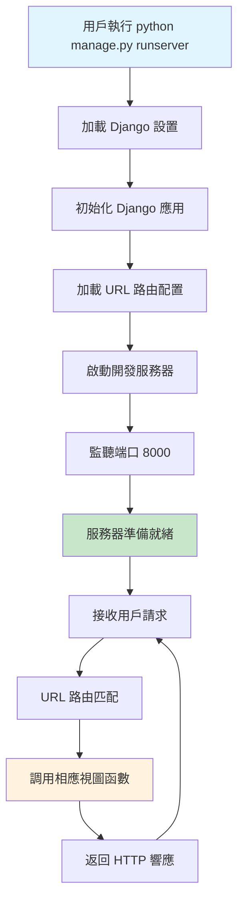
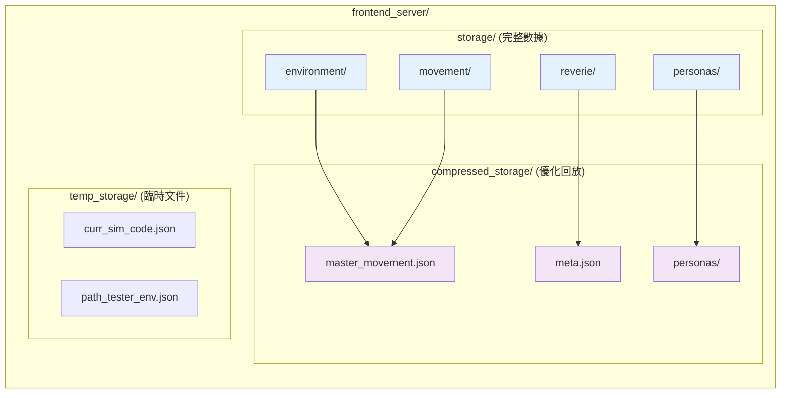
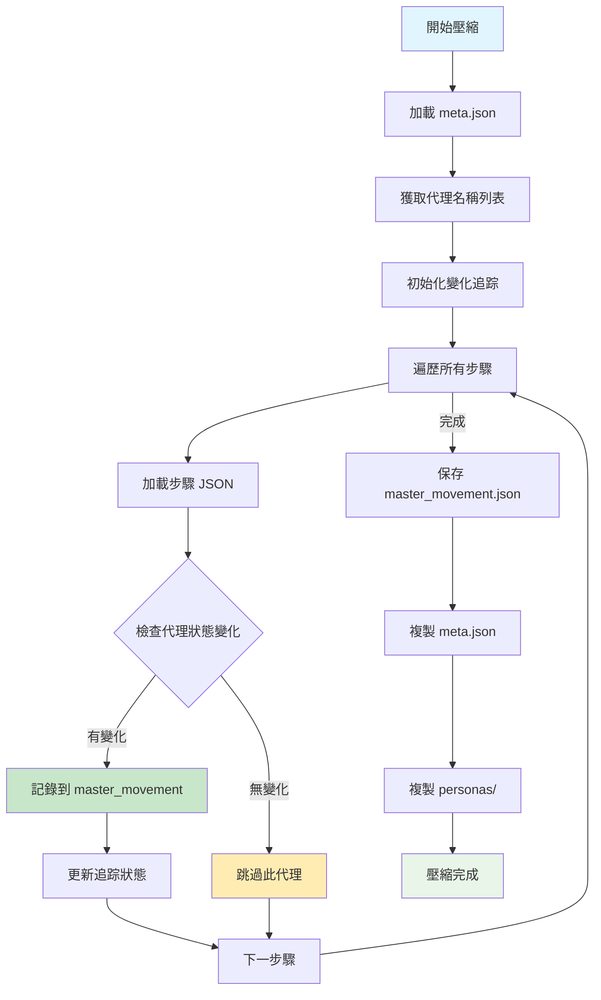

# Django manage.py 完整技術指南與回放教程

## 概覽

本指南詳細解釋 Django `manage.py` 在 Generative Agents 系統中的核心作用，包括服務器管理、回放系統、文件結構和完整的用戶操作流程。

## 🚀 Django manage.py 技術架構

### manage.py 核心功能

`manage.py` 是 Django 框架的命令行工具，在 Generative Agents 項目中充當前端服務器的入口點：

```python
#!/usr/bin/env python
"""Django's command-line utility for administrative tasks."""
import os
import sys

def main():
    os.environ.setdefault('DJANGO_SETTINGS_MODULE', 'frontend_server.settings')
    try:
        from django.core.management import execute_from_command_line
    except ImportError as exc:
        raise ImportError(
            "Couldn't import Django. Are you sure it's installed and "
            "available on your PYTHONPATH environment variable? Did you "
            "forget to activate a virtual environment?"
        ) from exc
    execute_from_command_line(sys.argv)

if __name__ == '__main__':
    main()
```

### Django 服務器啟動流程



## 🗂️ 文件結構深度解析

### 存儲架構概覽

系統使用雙重存儲架構：完整存儲（storage/）和壓縮存儲（compressed_storage/）



### 詳細目錄結構

```
environment/frontend_server/
├── manage.py                    # Django 管理工具
├── db.sqlite3                  # Django 數據庫
├── requirements.txt            # Python 依賴
├── storage/                    # 完整模擬數據存儲
│   └── [SIMULATION_CODE]/      # 具體模擬實例
│       ├── environment/        # 環境狀態快照
│       │   ├── 0.json         # 步驟 0 的環境數據
│       │   ├── 1.json         # 步驟 1 的環境數據
│       │   └── ...            # 更多步驟
│       ├── movement/           # 代理移動數據
│       │   ├── 0.json         # 步驟 0 的移動數據
│       │   ├── 1.json         # 步驟 1 的移動數據
│       │   └── ...            # 更多步驟
│       ├── personas/           # 代理個體數據
│       │   ├── Isabella Rodriguez/  # 具體代理文件夾
│       │   ├── Maria Lopez/         # 具體代理文件夾
│       │   └── Klaus Mueller/       # 具體代理文件夾
│       └── reverie/            # 模擬元數據
│           └── meta.json       # 模擬配置信息
├── compressed_storage/         # 壓縮回放數據
│   └── [SIMULATION_CODE]/      # 具體模擬實例
│       ├── master_movement.json    # 壓縮的移動數據
│       ├── meta.json              # 元數據副本
│       └── personas/              # 壓縮的代理數據
└── temp_storage/              # 臨時文件
    ├── curr_sim_code.json     # 當前模擬代碼
    └── path_tester_env.json   # 路徑測試環境
```

## 🏷️ 模擬文件命名規範

### 命名結構解析

模擬文件使用標準化命名格式：
```
July1_the_ville_isabella_maria_klaus-step-3-20
│    │     │           │      │     │ │  │   │
│    │     │           │      │     │ │  │   └── 最終步驟號 (20)
│    │     │           │      │     │ │  └────── 版本號 (3)
│    │     │           │      │     │ └───────── 步驟標識符
│    │     │           │      │     └─────────── 步驟前綴
│    │     │           │      └───────────────── 第三個代理名 (klaus)
│    │     │           └──────────────────────── 第二個代理名 (maria)
│    │     └──────────────────────────────────── 第一個代理名 (isabella)
│    └────────────────────────────────────────── 地圖名稱 (the_ville)
└─────────────────────────────────────────────── 日期標識 (July1)
```

### 命名組件說明

| 組件 | 描述 | 示例值 |
|------|------|--------|
| **日期前綴** | 模擬開始的日期標識 | `July1`, `March20` |
| **地圖名稱** | 使用的虛擬環境地圖 | `the_ville`, `oak_hill` |
| **代理名稱** | 參與模擬的代理姓名（小寫，下劃線分隔） | `isabella_maria_klaus` |
| **步驟標識** | 固定字符串 "step" | `step` |
| **版本號** | 模擬的迭代版本 | `3`, `1`, `2` |
| **最終步驟** | 模擬運行的最後步驟數 | `20`, `141`, `9` |

### 實際命名示例

```
基礎模板： base_the_ville_isabella_maria_klaus
完整模擬： July1_the_ville_isabella_maria_klaus-step-3-1
           July1_the_ville_isabella_maria_klaus-step-3-2
           July1_the_ville_isabella_maria_klaus-step-3-20
大型模擬： March20_the_ville_n25_UIST_RUN-step-1-141
```

## 📊 JSON 數據結構詳解

### movement/*.json 文件結構

每個移動文件包含特定步驟的所有代理狀態：

```json
{
  "persona": {
    "Isabella Rodriguez": {
      "movement": [73, 14],           // [x, y] 坐標位置
      "pronunciatio": "😴",           // 情緒表情符號
      "description": "sleeping @ the Ville:Isabella Rodriguez's apartment:main room:bed",
      "chat": null                    // 對話內容 (如有)
    },
    "Maria Lopez": {
      "movement": [123, 57],
      "pronunciatio": "😴",
      "description": "sleeping @ the Ville:Dorm for Oak Hill College:Maria Lopez's room:bed",
      "chat": null
    },
    "Klaus Mueller": {
      "movement": [127, 46],
      "pronunciatio": "💤",
      "description": "sleeping @ the Ville:Dorm for Oak Hill College:Klaus Mueller's room:bed",
      "chat": null
    }
  },
  "meta": {
    "curr_time": "February 13, 2023, 00:00:00"  // 模擬時間戳
  }
}
```

### meta.json 元數據結構

```json
{
  "fork_sim_code": "July1_the_ville_isabella_maria_klaus-step-3-19",  // 父模擬代碼
  "start_date": "February 13, 2023",                                  // 開始日期
  "curr_time": "February 14, 2023, 00:02:30",                        // 當前時間
  "sec_per_step": 10,                                                 // 每步秒數
  "maze_name": "the_ville",                                           // 地圖名稱
  "persona_names": [                                                  // 代理名稱列表
    "Isabella Rodriguez",
    "Maria Lopez", 
    "Klaus Mueller"
  ],
  "step": 8655                                                        // 總步數
}
```

### master_movement.json 壓縮格式

壓縮存儲只保存發生變化的代理狀態：

```json
{
  "0": {  // 步驟號
    "Isabella Rodriguez": {
      "movement": [73, 14],
      "pronunciatio": "😴",
      "description": "sleeping @ the Ville:Isabella Rodriguez's apartment:main room:bed",
      "chat": null
    }
    // 只包含此步驟有變化的代理
  },
  "1": {
    // 下一個有變化的步驟
  }
}
```

## 🎮 模擬回放系統詳解

### URL 路由架構

Django URL 配置定義了多種回放模式：

```python
urlpatterns = [
    url(r'^$', translator_views.landing, name='landing'),                    # 首頁
    url(r'^simulator_home$', translator_views.home, name='home'),            # 模擬器主頁
    url(r'^demo/(?P<sim_code>[\w-]+)/(?P<step>[\w-]+)/(?P<play_speed>[\w-]+)/$', 
        translator_views.demo, name='demo'),                                 # 演示模式
    url(r'^replay/(?P<sim_code>[\w-]+)/(?P<step>[\w-]+)/$', 
        translator_views.replay, name='replay'),                             # 回放模式
    url(r'^replay_persona_state/(?P<sim_code>[\w-]+)/(?P<step>[\w-]+)/(?P<persona_name>[\w-]+)/$', 
        translator_views.replay_persona_state, name='replay_persona_state'), # 代理狀態查看
]
```

### 回放模式對比

| 模式 | URL 格式 | 數據源 | 特點 | 用途 |
|------|----------|--------|------|------|
| **Demo** | `/demo/sim_code/step/speed/` | compressed_storage | 優化播放、可調速度 | 公開展示、快速預覽 |
| **Replay** | `/replay/sim_code/step/` | storage | 完整數據、逐步控制 | 詳細分析、調試 |
| **Persona State** | `/replay_persona_state/sim_code/step/persona/` | storage/compressed | 個體內部狀態 | 代理行為分析 |

## 📋 完整的回放操作指南

### 步驟 1: 啟動 Django 服務器

```bash
# 導航到前端服務器目錄
cd environment/frontend_server/

# 啟動 Django 開發服務器
python manage.py runserver

# 服務器將在 http://127.0.0.1:8000/ 啟動
```

### 步驟 2: 識別可用的模擬文件

#### 方法 A: 檢查 storage 目錄（完整數據）

```bash
# 列出所有完整模擬
ls environment/frontend_server/storage/

# 示例輸出：
# base_the_ville_isabella_maria_klaus/
# July1_the_ville_isabella_maria_klaus-step-3-1/
# July1_the_ville_isabella_maria_klaus-step-3-20/
```

#### 方法 B: 檢查 compressed_storage 目錄（演示數據）

```bash
# 列出所有壓縮模擬
ls environment/frontend_server/compressed_storage/

# 示例輸出：
# July1_the_ville_isabella_maria_klaus-step-3-20/
```

### 步驟 3: 構建回放 URL

#### Demo 模式 URL 構建

```
基本格式：http://127.0.0.1:8000/demo/{sim_code}/{start_step}/{play_speed}/

參數說明：
- sim_code: 模擬代碼（必須存在於 compressed_storage/）
- start_step: 開始步驟（0 為最開始）
- play_speed: 播放速度（1-6，數字越大越快）

實例：
http://127.0.0.1:8000/demo/July1_the_ville_isabella_maria_klaus-step-3-20/0/3/
```

#### Replay 模式 URL 構建

```
基本格式：http://127.0.0.1:8000/replay/{sim_code}/{start_step}/

實例：
http://127.0.0.1:8000/replay/July1_the_ville_isabella_maria_klaus-step-3-20/0/
```

#### 代理狀態查看 URL 構建

```
基本格式：http://127.0.0.1:8000/replay_persona_state/{sim_code}/{step}/{persona_name}/

注意：persona_name 使用下劃線替換空格

實例：
http://127.0.0.1:8000/replay_persona_state/July1_the_ville_isabella_maria_klaus-step-3-20/100/Isabella_Rodriguez/
```

## 🔄 數據處理流程詳解

### 完整的數據流程圖

```mermaid
flowchart TD
    subgraph "後端模擬"
        Backend[Reverie Backend] --> Storage[storage/ 目錄]
        Storage --> Env[environment/*.json]
        Storage --> Move[movement/*.json]
        Storage --> Personas[personas/*/]
        Storage --> Meta[reverie/meta.json]
    end
    
    subgraph "壓縮處理"
        Storage --> Compress[compress_sim_storage.py]
        Compress --> CompStorage[compressed_storage/]
        CompStorage --> MasterMove[master_movement.json]
        CompStorage --> MetaCopy[meta.json]
        CompStorage --> PersonasCopy[personas/]
    end
    
    subgraph "Web 服務"
        Django[Django manage.py runserver] --> URLRoute[URL 路由]
        URLRoute --> DemoView[demo() 視圖]
        URLRoute --> ReplayView[replay() 視圖]
        URLRoute --> PersonaView[replay_persona_state() 視圖]
    end
    
    subgraph "前端展示"
        DemoView --> CompStorage
        ReplayView --> Storage
        PersonaView --> Storage
        
        DemoView --> WebDemo[Web 演示界面]
        ReplayView --> WebReplay[Web 回放界面]
        PersonaView --> WebPersona[代理狀態界面]
    end
    
    style Backend fill:#e1f5fe
    style Compress fill:#fff3e0
    style Django fill:#e8f5e8
    style WebDemo fill:#fce4ec
    style WebReplay fill:#fce4ec
    style WebPersona fill:#fce4ec
```

### 壓縮算法詳解

`compress_sim_storage.py` 的優化策略：



### 變化檢測邏輯

系統檢查以下四個屬性的變化：

1. **movement**: 位置坐標 [x, y]
2. **pronunciatio**: 表情符號
3. **description**: 活動描述
4. **chat**: 對話內容

只有當任一屬性發生變化時，該代理的狀態才會被記錄到壓縮文件中。

## 🛠️ 故障排除指南

### 常見問題和解決方案

#### 1. 服務器無法啟動

**症狀**: `python manage.py runserver` 失敗

**可能原因**:
- Django 未安裝
- Python 環境問題
- 端口被占用

**解決方案**:
```bash
# 檢查 Django 安裝
pip install django

# 檢查端口占用
netstat -an | findstr :8000

# 使用不同端口
python manage.py runserver 8001
```

#### 2. 模擬文件不存在

**症狀**: 訪問回放 URL 時出現 404 或錯誤

**診斷步驟**:
```bash
# 檢查模擬是否存在
ls environment/frontend_server/storage/July1_the_ville_isabella_maria_klaus-step-3-20/

# 檢查壓縮版本是否存在
ls environment/frontend_server/compressed_storage/July1_the_ville_isabella_maria_klaus-step-3-20/

# 檢查文件完整性
ls environment/frontend_server/storage/July1_the_ville_isabella_maria_klaus-step-3-20/movement/
```

**解決方案**:
- 確保模擬代碼拼寫正確
- 檢查文件路徑是否存在
- 運行壓縮腳本生成 compressed_storage 版本

#### 3. 代理名稱錯誤

**症狀**: 代理狀態頁面無法加載

**解決方案**:
- 使用下劃線替換空格：`Isabella Rodriguez` → `Isabella_Rodriguez`
- 檢查 meta.json 中的準確代理名稱

#### 4. 步驟範圍錯誤

**症狀**: 特定步驟無法加載

**診斷**:
```bash
# 檢查最大步驟數
ls environment/frontend_server/storage/July1_the_ville_isabella_maria_klaus-step-3-20/movement/ | wc -l

# 檢查 meta.json 中的步驟數
cat environment/frontend_server/storage/July1_the_ville_isabella_maria_klaus-step-3-20/reverie/meta.json | grep step
```

## 🔍 高級使用技巧

### 1. 批量壓縮模擬

```python
# 修改 compress_sim_storage.py 的主函數
if __name__ == '__main__':
    simulations = [
        "July1_the_ville_isabella_maria_klaus-step-3-1",
        "July1_the_ville_isabella_maria_klaus-step-3-20",
        # 添加更多模擬代碼
    ]
    for sim_code in simulations:
        compress(sim_code)
        print(f"Compressed: {sim_code}")
```

### 2. 自定義播放速度

Demo 模式支持 6 級播放速度：

| 速度級別 | 實際倍率 | 適用場景 |
|----------|----------|----------|
| 1 | 1x | 詳細觀察 |
| 2 | 2x | 正常觀看 |
| 3 | 4x | 快速預覽 |
| 4 | 8x | 概覽模式 |
| 5 | 16x | 超快模式 |
| 6 | 32x | 極速模式 |

### 3. API 端點直接訪問

```bash
# 獲取特定步驟的移動數據
curl -X POST http://127.0.0.1:8000/update_environment/ \
  -H "Content-Type: application/json" \
  -d '{"step": 100, "sim_code": "July1_the_ville_isabella_maria_klaus-step-3-20"}'

# 提交環境數據
curl -X POST http://127.0.0.1:8000/process_environment/ \
  -H "Content-Type: application/json" \
  -d '{"step": 100, "sim_code": "sim_code", "environment": {}}'
```

## 🎯 最佳實踐建議

### 1. 性能優化

- 使用 Demo 模式進行快速預覽
- 定期清理 temp_storage 中的臨時文件
- 壓縮長時間運行的模擬以節省存儲空間

### 2. 調試技巧

- 使用 Replay 模式進行詳細的步驟分析
- 檢查 meta.json 確認模擬參數
- 監控 movement 文件的大小變化

### 3. 數據管理

- 定期備份重要的模擬數據
- 為不同實驗使用描述性的模擬名稱
- 保持 storage 和 compressed_storage 的同步

## 📈 系統監控

### 重要指標

1. **存儲使用量**: 監控 storage 目錄大小
2. **步驟數量**: 追踪模擬的進度
3. **代理活躍度**: 分析代理狀態變化頻率

### 日志分析

```bash
# 檢查 Django 服務器日志
python manage.py runserver --verbosity=2

# 分析特定模擬的步驟分佈
find storage/July1_the_ville_isabella_maria_klaus-step-3-20/movement/ -name "*.json" | wc -l
```

## 結論

Django `manage.py` 在 Generative Agents 系統中扮演著關鍵角色，它不僅管理 Web 服務器的運行，還提供了完整的模擬回放和分析功能。通過理解文件結構、命名規範和回放系統，用戶可以有效地分析和展示代理行為模擬結果。

此指南提供了從基礎設置到高級技巧的完整覆蓋，幫助用戶充分利用這個強大的模擬回放系統。
