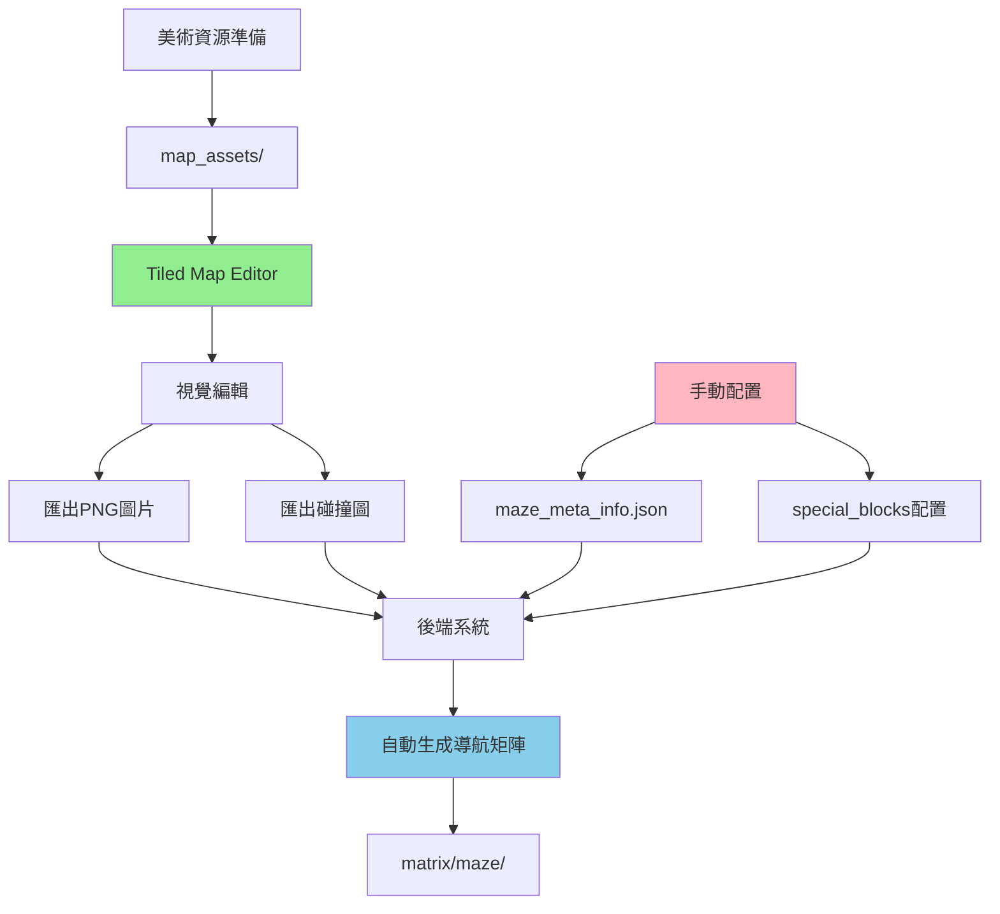

# 地圖數據來源詳解

本文檔澄清生成式代理項目中各種地圖相關文件的實際來源，糾正之前文檔中的不準確描述。

## 📋 文件來源總覽

### ✅ **由 Tiled Map Editor 直接生成**
| 文件 | 用途 | 生成方式 |
|------|------|----------|
| `the_ville2.png` | 主地圖視覺圖片 | Tiled匯出 |
| `the_ville collision.png` | 碰撞檢測圖 | Tiled匯出 |
| `the_ville.tmx` | Tiled專案源文件 | Tiled保存 |

### ❌ **非 Tiled Map Editor 生成**
| 文件 | 用途 | 來源 | 備註 |
|------|------|------|------|
| `maze_meta_info.json` | 地圖元數據配置 | **手動編寫** | 必須手動更新 |
| `matrix/maze/` | 導航矩陣數據 | **後端算法生成** | 自動生成，勿手動編輯 |
| `special_blocks/` | 特殊區塊定義 | **手動配置** | 需要手動定義 |
| `map_assets/` | 瓦片資源庫 | **美術資源** | 預先準備的素材 |

## 🔄 正確的工作流程

## 📊 各組件詳細說明

### 🎨 **Tiled Map Editor 負責部分**
- **功能**: 視覺設計和碰撞檢測
- **輸出**: PNG圖片文件
- **限制**: 僅處理視覺層面

### 📝 **手動配置部分**
- **maze_meta_info.json**: 地圖基本參數
- **special_blocks/**: 功能區域定義
- **需要**: 文本編輯器手動編寫

### 🤖 **後端自動生成部分**
- **matrix/maze/**: 導航網格
- **生成時機**: 模擬器啟動時
- **依賴**: 碰撞圖 + 元數據

## ⚠️ 常見誤解澄清

### ❌ 錯誤認知：
> "所有地圖數據都由Tiled生成"

### ✅ 正確理解：
- **Tiled只負責視覺部分**
- **邏輯數據需要額外步驟**
- **導航矩陣完全自動生成**

## 🎯 實際操作建議

### 編輯新地圖時：
1. **先用Tiled設計視覺效果**
2. **手動配置元數據**
3. **定義特殊區塊**
4. **讓後端自動生成導航數據**

### 避免的操作：
- ❌ 不要手動編輯 `matrix/maze/` 文件
- ❌ 不要期望Tiled生成邏輯配置
- ❌ 不要忽略元數據的手動更新

## 🔗 相關文檔
- [Tiled Map Editor 使用指南](tiled-map-editor-guide.md)
- [地圖編輯完整流程](map-editing-workflow.md)

---

*本文檔更新於2025年1月8日，用於澄清地圖數據的真實來源*
