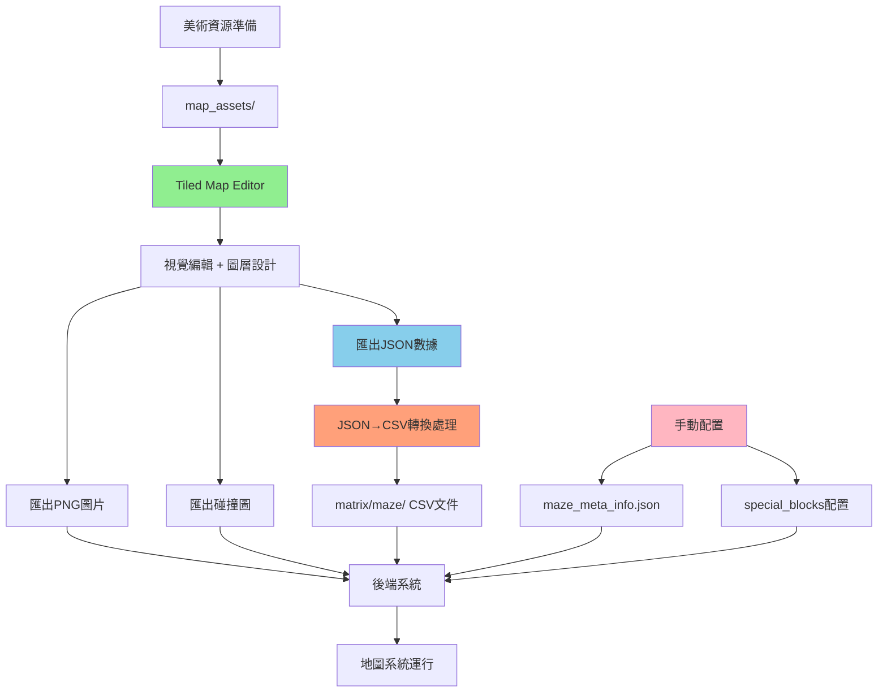

# 地圖數據來源詳解

本文檔澄清生成式代理項目中各種地圖相關文件的實際來源，糾正之前文檔中的不準確描述。

## 📋 文件來源總覽

### ✅ **由 Tiled Map Editor 直接生成**
| 文件 | 用途 | 生成方式 | 路徑 |
|------|------|----------|------|
| `the_ville2.png` | 主地圖視覺圖片 | Tiled匯出 | `static_dirs/assets/the_ville/visuals/` |
| `the_ville collision.png` | 碰撞檢測圖 | Tiled匯出 | `static_dirs/assets/the_ville/visuals/` |
| `the_ville.tmx` | Tiled專案源文件 | Tiled保存 | `static_dirs/assets/the_ville/visuals/` |
| `the_ville_dec31.json` | **地圖矩陣數據JSON** | **Tiled匯出** | `static_dirs/assets/the_ville/visuals/` |
| `the_ville_jan7.json` | **地圖矩陣數據JSON** | **Tiled匯出** | `static_dirs/assets/the_ville/visuals/` |
| `the_ville_jan7-2.json` | **地圖矩陣數據JSON** | **Tiled匯出** | `static_dirs/assets/the_ville/visuals/` |

### 🔄 **由 Tiled JSON 轉換生成**
| 文件 | 用途 | 來源 | 備註 | 路徑 |
|------|------|------|------|------|
| `collision_maze.csv` | 碰撞檢測矩陣 | **JSON轉換** | 來自Tiled JSON | `matrix/maze/` |
| `sector_maze.csv` | 區域劃分矩陣 | **JSON轉換** | 來自Tiled JSON | `matrix/maze/` |
| `arena_maze.csv` | 場館定位矩陣 | **JSON轉換** | 來自Tiled JSON | `matrix/maze/` |
| `game_object_maze.csv` | 遊戲物件矩陣 | **JSON轉換** | 來自Tiled JSON | `matrix/maze/` |
| `spawning_location_maze.csv` | 生成點矩陣 | **JSON轉換** | 來自Tiled JSON | `matrix/maze/` |

### 📝 **手動配置文件**
| 文件 | 用途 | 來源 | 備註 |
|------|------|------|------|
| `maze_meta_info.json` | 地圖元數據配置 | **手動編寫** | 必須手動更新 |
| `special_blocks/` | 特殊區塊定義 | **手動配置** | 需要手動定義 |
| `map_assets/` | 瓦片資源庫 | **美術資源** | 預先準備的素材 |

## 🔄 正確的工作流程



## 📊 各組件詳細說明

### 🎨 **Tiled Map Editor 負責部分**
- **功能**: 
  - 視覺設計和碰撞檢測圖層
  - **完整地圖矩陣數據生成**
  - 區域(sector)、場館(arena)、物件層定義
- **輸出**: 
  - PNG圖片文件
  - **JSON矩陣數據文件 (包含所有圖層信息)**
- **能力**: **處理完整的地圖邏輯結構，不僅限於視覺**

### 🔄 **JSON→CSV轉換處理**
- **輸入**: Tiled匯出的JSON文件
- **輸出**: 後端可讀取的CSV矩陣文件
- **處理內容**: 
  - 碰撞檢測數據轉換
  - 區域劃分數據轉換  
  - 場館位置數據轉換
  - 遊戲物件數據轉換
  - 生成點數據轉換

### 📝 **手動配置部分**
- **maze_meta_info.json**: 地圖基本參數配置
- **special_blocks/**: 功能區域定義文件
- **需要**: 文本編輯器手動編寫和維護

### 🤖 **後端系統處理**
- **讀取**: CSV矩陣文件 + 元數據配置
- **運行時**: 路徑計算、碰撞檢測、事件處理
- **依賴**: **轉換後的CSV文件，非直接算法生成**

## ⚠️ 常見誤解澄清

### ❌ 錯誤認知：
1. > "matrix/maze/ 文件由後端算法自動生成"
2. > "Tiled只負責視覺部分"  
3. > "導航矩陣完全自動生成"

### ✅ 正確理解：
1. **matrix/maze/ 文件來自Tiled JSON轉換**
2. **Tiled負責完整的地圖邏輯結構設計**
3. **導航矩陣源於Tiled的圖層設計**

## 🎯 實際操作建議

### 編輯新地圖時：
1. **在Tiled中設計完整地圖結構**
   - 設置碰撞圖層
   - 定義區域劃分
   - 配置場館位置
   - 放置遊戲物件
2. **從Tiled匯出JSON文件**
3. **執行JSON→CSV轉換處理**
4. **手動配置元數據和特殊區塊**
5. **測試後端地圖系統**

### 避免的操作：
- ❌ 不要手動編輯 `matrix/maze/*.csv` 文件
- ❌ 不要期望後端自動生成地圖數據  
- ❌ 不要忽略Tiled JSON匯出的重要性
- ❌ 不要忘記更新元數據配置

## 📁 重要文件路徑參考

### Tiled相關文件：
```
static_dirs/assets/the_ville/visuals/
├── the_ville.tmx (Tiled專案文件)
├── the_ville2.png (地圖視覺圖)
├── the_ville collision.png (碰撞圖)
├── the_ville_dec31.json (JSON矩陣數據)
├── the_ville_jan7.json (JSON矩陣數據) 
└── the_ville_jan7-2.json (JSON矩陣數據)
```

### 後端矩陣文件：
```
matrix/maze/
├── collision_maze.csv
├── sector_maze.csv
├── arena_maze.csv
├── game_object_maze.csv
└── spawning_location_maze.csv
```

## 🔗 相關文檔
- [Tiled Map Editor 使用指南](tiled-map-editor-guide.md)
- [地圖編輯完整流程](map-editing-workflow.md)
- [迷宮系統技術詳解](maze-py-technical-guide.md)

---

*本文檔更新於2025年1月8日，修正地圖數據來源的不準確描述*
