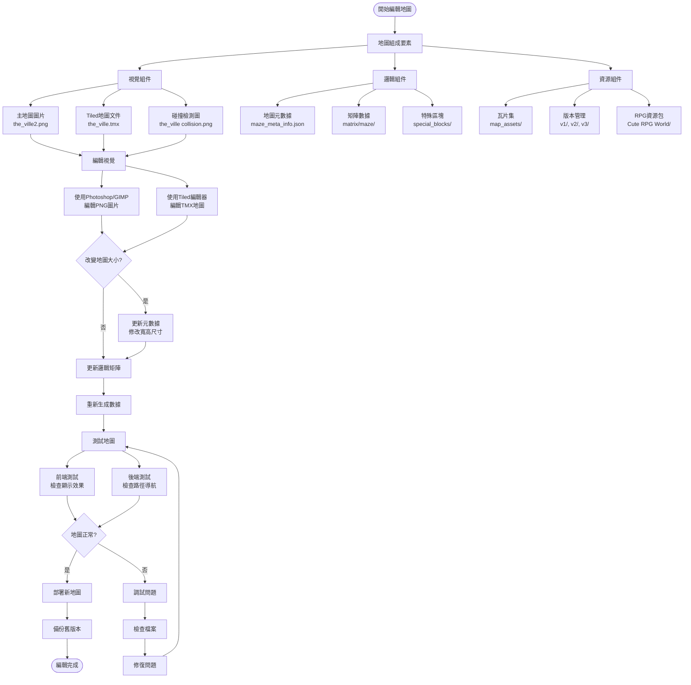

# 地圖編輯完整流程

本文檔詳細說明如何編輯、自定義和重新設計生成式代理項目中的虛擬世界地圖，包括視覺效果和邏輯結構。

## 🗺️ 地圖編輯完整流程圖



## 📁 地圖文件結構

### 🎨 視覺檔案位置：
```
environment/frontend_server/static_dirs/assets/the_ville/visuals/
├── the_ville2.png                    (主地圖圖片 - 遊戲中實際顯示)
├── the_ville collision.png           (碰撞檢測圖 - 定義可行走區域)
├── the_ville.tmx                     (Tiled地圖專案檔 - 可編輯源檔)
├── the_ville_dec31.json             (地圖版本數據)
├── the_ville_jan7.json              (地圖版本數據)  
├── the_ville_old.json               (舊版本地圖數據)
└── map_assets/                       (瓦片資源庫)
    ├── blocks/                       (基礎方塊瓦片)
    ├── v1/, v2/, v3/                 (不同版本資源)
    ├── Cute RPG World 40 usd packet/ (商業RPG瓦片包)
    └── cute_rpg_word_VXAce/          (RPG Maker風格資源)
```

### 🧠 邏輯檔案位置：
```
environment/frontend_server/static_dirs/assets/the_ville/matrix/
├── maze_meta_info.json               (地圖元數據)
│   ├── world_name: "the ville"       (世界名稱)
│   ├── maze_width: 140               (地圖寬度：140格)
│   ├── maze_height: 100              (地圖高度：100格)
│   ├── sq_tile_size: 32              (每格像素：32x32)
│   └── special_constraint: ""        (特殊約束)
├── maze/                             (路徑導航矩陣)
└── special_blocks/                   (特殊區塊定義)
```

## 🛠️ 編輯工具和軟體

### 1. **Tiled Map Editor** (推薦主要工具)
- **下載**: https://www.mapeditor.org/
- **用途**: 編輯TMX地圖檔案，設計地圖佈局
- **功能**: 圖層管理、瓦片放置、匯出PNG

### 2. **圖像編輯軟體**
- **Photoshop** - 專業圖像編輯
- **GIMP** - 免費開源替代方案
- **Aseprite** - 像素藝術專用編輯器

### 3. **程式編輯器**
- **VSCode** - 編輯JSON配置檔案
- **任何文本編輯器** - 修改元數據

## 🎯 地圖編輯步驟詳解

### 步驟 1: 準備和備份
```bash
# 備份現有地圖檔案
cp -r environment/frontend_server/static_dirs/assets/the_ville/ backup_the_ville/
```

### 步驟 2: 使用Tiled開始編輯
1. **安裝Tiled Map Editor**
2. **開啟TMX檔案**: 打開 `the_ville.tmx`
3. **熟悉介面**: 
   - 左側瓦片面板
   - 中央編輯區域
   - 右側圖層管理

### 步驟 3: 導入和管理瓦片集
```
檔案 → 導入瓦片集 → 選擇 map_assets/ 中的圖片
```

#### 可用瓦片資源：
- **v1/, v2/, v3/** - 基礎建築和地形
- **Cute RPG World/** - 完整RPG風格瓦片包
- **blocks/** - 簡單方塊元素

### 步驟 4: 圖層編輯
#### 典型圖層結構：
1. **Background** - 地面和背景
2. **Buildings** - 建築物
3. **Decorations** - 裝飾元素
4. **Collision** - 碰撞檢測（不可見）

### 步驟 5: 設置碰撞檢測
1. 創建專用碰撞圖層
2. 使用特殊瓦片標記不可通行區域
3. 匯出時生成 `collision.png`

### 步驟 6: 匯出地圖
```
檔案 → 匯出為 → 圖片
```

#### 匯出設置：
- **解析度**: 維持32x32像素瓦片
- **尺寸**: 140x100格 = 4480x3200像素
- **格式**: PNG（帶透明度支援）

### 步驟 7: 更新元數據
如果改變地圖尺寸，需要修改：
```json
{
  "world_name": "the ville",
  "maze_width": 140,    // 新寬度
  "maze_height": 100,   // 新高度
  "sq_tile_size": 32,
  "special_constraint": ""
}
```

### 步驟 8: 重新生成邏輯數據
- 更新路徑導航矩陣
- 重新定義特殊區塊
- 測試代理移動路徑

## 🧪 測試和驗證

### 前端視覺測試：
1. 啟動前端服務器
2. 訪問 `http://127.0.0.1:8000/`
3. 檢查地圖顯示是否正確

### 後端邏輯測試：
1. 運行簡單模擬
2. 觀察代理是否能正常移動
3. 確認碰撞檢測正常工作

### 常見問題檢查：
- **地圖不顯示**: 檢查PNG檔案路徑和尺寸
- **代理卡住**: 檢查碰撞檢測設置
- **移動異常**: 驗證元數據配置

## 🎨 設計建議和最佳實踐

### 地圖設計原則：
1. **保持32x32瓦片標準** - 確保與系統相容
2. **明確的通道設計** - 代理需要清晰的移動路徑
3. **功能區域劃分** - 住宅、商業、娛樂區域
4. **視覺層次感** - 前景、中景、背景分層

### 性能優化：
- **適度的地圖尺寸** - 過大影響性能
- **合理的瓦片複用** - 減少資源占用
- **簡化碰撞檢測** - 避免過於複雜的形狀

### 代理行為考量：
- **充足的聚集空間** - 咖啡廳、公園等社交區域
- **多樣化的場所** - 工作、娛樂、購物場所
- **連通的路徑設計** - 確保所有區域可達

## 🔄 版本管理和迭代

### 版本控制建議：
```
the_ville_v1.0.tmx    (原始版本)
the_ville_v1.1.tmx    (小幅修改)
the_ville_v2.0.tmx    (重大改版)
```

### 漸進式改進：
1. **小範圍測試** - 先修改地圖小部分
2. **功能驗證** - 確保基本功能正常
3. **逐步擴展** - 逐漸增加新區域和功能

## ⚠️ 重要注意事項

1. **文件備份**: 編輯前務必備份原始檔案
2. **尺寸一致**: 保持像素尺寸與元數據一致
3. **路徑測試**: 確保代理能到達所有重要區域
4. **性能監控**: 大幅修改後監控系統性能

## 🔗 相關資源

- **Tiled官方文檔**: https://doc.mapeditor.org/
- **RPG瓦片資源**: https://opengameart.org/
- **像素藝術教程**: 搜索"pixel art tutorial"
- **地圖設計靈感**: 經典RPG遊戲地圖參考

---

*本文檔基於實際地圖編輯經驗編寫，更新於2025年1月8日。建議結合實際操作逐步掌握地圖編輯技能。*
