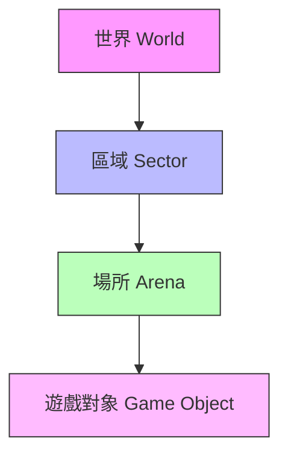
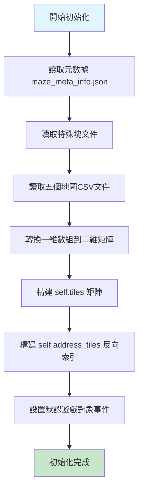

# maze.py 技術詳解 - 地圖管理核心組件

## 概述

`maze.py` 是生成式代理項目的核心地圖管理模塊，定義了 `Maze` 類來表示和管理模擬世界的二維地圖。該組件負責加載、解析和管理整個虛擬世界的空間結構，為代理的移動、交互和感知提供基礎支持。

## 核心功能架構

### 1. 多層地圖系統

系統採用四層架構來組織空間信息：



### 2. 數據來源結構

地圖數據來自以下CSV文件：

| 文件類型 | 路徑 | 用途 |
|---------|------|------|
| 碰撞地圖 | `collision_maze.csv` | 標記不可通行區域 |
| 區域地圖 | `sector_maze.csv` | 定義區域邊界 |
| 場所地圖 | `arena_maze.csv` | 標記具體場所 |
| 對象地圖 | `game_object_maze.csv` | 放置遊戲對象 |
| 生成點地圖 | `spawning_location_maze.csv` | 定義代理生成位置 |

### 3. 特殊塊定義文件

| 文件類型 | 示例內容 | 說明 |
|---------|----------|------|
| world_blocks.csv | `"25335, Double Studio, Studio, Common Room"` | 世界級別定義 |
| sector_blocks.csv | `"25331, Double Studio, Studio, Bedroom 2, Painting"` | 區域級別定義 |
| arena_blocks.csv | 顏色碼對應場所 | 場所級別映射 |
| game_object_blocks.csv | 顏色碼對應對象 | 遊戲對象映射 |
| spawning_location_blocks.csv | 顏色碼對應生成點 | 代理起始位置 |

## 核心類和方法詳解

### Maze類初始化流程



### 主要數據結構

#### self.tiles 結構說明
每個瓦片包含以下信息：
```python
self.tiles[row][col] = {
    'world': '世界名稱',
    'sector': '區域名稱', 
    'arena': '場所名稱',
    'game_object': '對象名稱',
    'spawning_location': '生成點名稱',
    'collision': False/True,  # 是否為碰撞塊
    'events': set()  # 事件集合
}
```

#### 事件系統結構
事件以元組形式存儲：
```python
# 格式：(對象路徑, 主體, 謂語, 對象)
event = ('double studio:double studio:bedroom 2:bed', None, None, None)
```

## 核心方法詳解

### 1. 坐標轉換方法

#### turn_coordinate_to_tile(px_coordinate)
**功能**：將像素坐標轉換為瓦片坐標

```python
def turn_coordinate_to_tile(self, px_coordinate): 
    x = math.ceil(px_coordinate[0]/self.sq_tile_size)
    y = math.ceil(px_coordinate[1]/self.sq_tile_size)
    return (x, y)
```

**參數**：
- `px_coordinate`: 像素坐標 (x, y)

**返回值**：
- 瓦片坐標 (x, y)

**示例**：`(1600, 384)` → `(50, 12)`

### 2. 瓦片信息訪問

#### access_tile(tile)
**功能**：獲取指定瓦片的詳細信息

```python
def access_tile(self, tile): 
    x = tile[0]
    y = tile[1]
    return self.tiles[y][x]
```

**返回示例**：
```python
{
    'world': 'double studio', 
    'sector': 'double studio', 
    'arena': 'bedroom 2', 
    'game_object': 'bed', 
    'spawning_location': 'bedroom-2-a', 
    'collision': False,
    'events': {('double studio:double studio:bedroom 2:bed', None, None, None)}
}
```

### 3. 路徑字符串生成

#### get_tile_path(tile, level)
**功能**：根據指定層級生成地址字符串

**層級類型**：
- `"world"` → `"double studio"`
- `"sector"` → `"double studio:double studio"`  
- `"arena"` → `"double studio:double studio:bedroom 2"`
- `"game_object"` → `"double studio:double studio:bedroom 2:bed"`

### 4. 視野範圍計算

#### get_nearby_tiles(tile, vision_r)
**功能**：獲取指定半徑內的所有瓦片


**視野模式**：方形範圍
```
x x x x x 
x x x x x
x x P x x 
x x x x x
x x x x x
```

### 5. 事件管理方法

#### add_event_from_tile(curr_event, tile)
**功能**：向指定瓦片添加事件
```python
self.tiles[tile[1]][tile[0]]["events"].add(curr_event)
```

#### remove_event_from_tile(curr_event, tile)
**功能**：從指定瓦片移除事件

#### remove_subject_events_from_tile(subject, tile)
**功能**：移除指定主體的所有事件

## 技術實現細節

### 1. 數據轉換流程

#### 一維到二維矩陣轉換
原始CSV數據為一維數組，需要根據地圖寬度進行切分：

```python
for i in range(0, len(collision_maze_raw), meta_info["maze_width"]): 
    tw = meta_info["maze_width"]
    self.collision_maze += [collision_maze_raw[i:i+tw]]
```

### 2. 反向索引機制

#### self.address_tiles 構建
為每個地址創建包含所有相關瓦片坐標的集合：

```python
# 示例結果
self.address_tiles['<spawn_loc>bedroom-2-a'] = {(58, 9)}
self.address_tiles['double studio:recreation:pool table'] = {
    (29, 14), (31, 11), (30, 14), (32, 11), ...
}
```

**用途**：
- 路徑規劃優化
- 快速空間查詢  
- 代理移動計算

### 3. 顏色ID映射系統

#### 工作原理
1. **Tiled編輯器導出**：含顏色編碼的CSV文件
2. **特殊塊文件**：顏色ID到語義名稱的映射
3. **矩陣構建**：將數字ID轉換為語義信息

#### 映射過程
```python
if sector_maze[i][j] in sb_dict: 
    tile_details["sector"] = sb_dict[sector_maze[i][j]]
```

## 實際應用場景

### 1. 代理移動系統
- **路徑規劃**：使用 `self.address_tiles` 快速找到目標區域
- **碰撞檢測**：檢查 `collision` 屬性避免非法移動
- **視野計算**：使用 `get_nearby_tiles` 確定感知範圍

### 2. 事件系統
- **空間事件**：每個瓦片可包含多個並發事件
- **對象交互**：通過事件系統處理代理與環境的交互
- **狀態追蹤**：動態添加和移除事件來反映環境變化

### 3. 空間查詢優化
- **區域查找**：通過地址字符串快速定位空間
- **鄰域分析**：計算代理周圍的環境信息
- **層級導航**：支持從世界到對象的多級定位

## 調試和故障排除

### 常見問題

#### 1. 坐標轉換錯誤
**症狀**：代理位置顯示異常  
**檢查**：驗證 `sq_tile_size` 設置和像素坐標計算

#### 2. 地圖加載失敗
**症狀**：初始化時出錯  
**檢查**：
- CSV文件路徑是否正確
- 文件格式是否符合要求
- `maze_meta_info.json` 中的尺寸設置

#### 3. 事件同步問題
**症狀**：事件狀態不一致  
**檢查**：
- 事件添加和移除的時序
- 多線程訪問的同步機制

### 調試工具方法

#### 檢查瓦片信息
```python
maze = Maze("the_ville")
tile_info = maze.access_tile((50, 12))
print(f"瓦片信息: {tile_info}")
```

#### 驗證地址映射
```python
addresses = maze.address_tiles.keys()
for addr in addresses:
    if "bedroom" in addr:
        print(f"{addr}: {maze.address_tiles[addr]}")
```

## 性能考慮

### 優化建議
1. **內存使用**：大地圖時考慮瓦片懶加載
2. **查詢效率**：利用 `address_tiles` 索引減少遍歷
3. **事件管理**：定期清理無效事件避免內存洩露

## 擴展可能性

### 未來改進方向
1. **多層地圖支持**：添加Z軸維度
2. **動態地圖**：支持運行時地圖修改
3. **更精細的碰撞檢測**：支持部分可通行區域
4. **空間索引優化**：使用四叉樹等高級數據結構

---

## 相關連結
- [[color-id-system-guide]] - 顏色ID系統詳解
- [[map-data-sources]] - 地圖數據來源說明
- [[generative-agents-workflow]] - 整體使用流程

**創建時間**: 2025年1月8日  
**最後更新**: 2025年1月8日  
**版本**: v1.0
