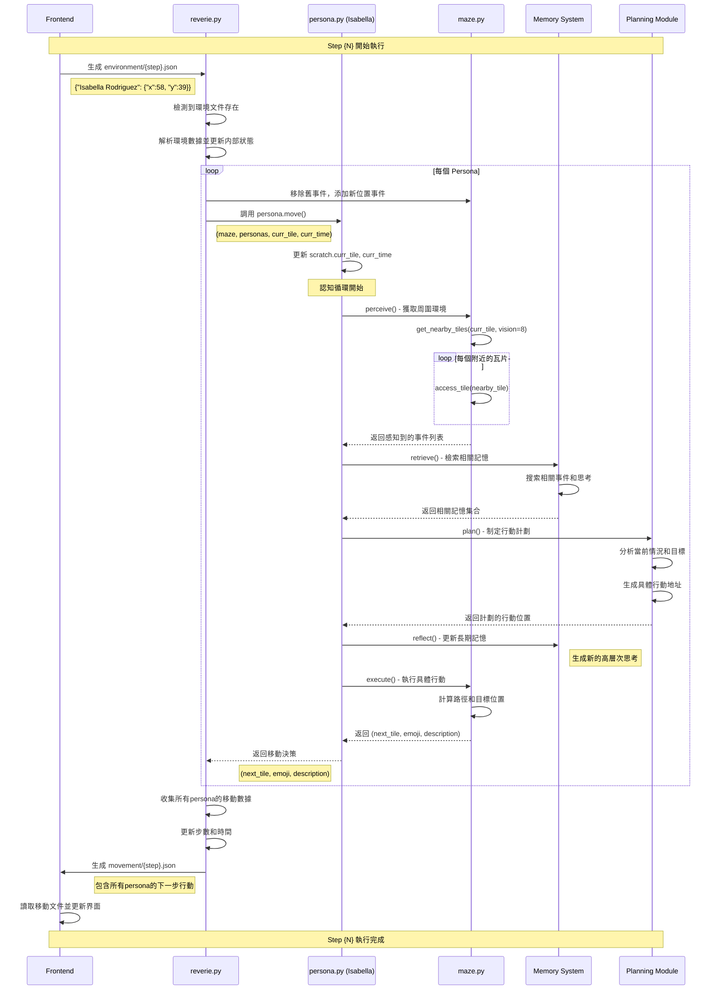

# Step-by-Step 數據流程完整指南

## 📖 概述

本文檔詳細解析 Generative Agents 項目中每個 step 的完整數據流程，從前端環境輸入到後端認知處理，再到移動輸出的整個過程。理解這個流程對於調試、優化和擴展系統至關重要。

### 什麼是一個 Step？

一個 **step** 代表模擬世界中的一個時間週期，通常對應：
- **時間前進**：根據 `sec_per_step` 設定（默認10秒）
- **所有代理思考和行動**：每個persona執行完整認知循環
- **環境狀態更新**：地圖事件和代理位置同步

---

## 🔄 完整數據流程架構

```mermaid
flowchart TD
    subgraph "前端系統 Frontend"
        A[用戶界面顯示當前狀態] --> B[等待用戶操作或自動推進]
        B --> C[生成 environment/{step}.json]
        C --> D[包含所有persona當前坐標]
    end
    
    subgraph "後端主控制器 reverie.py"
        E[start_server 主循環等待] --> F[檢測到環境文件]
        F --> G[讀取並解析環境數據]
        G --> H[更新後端地圖狀態]
        H --> I[遍歷所有persona調用認知系統]
        I --> J[收集所有移動決策]
        J --> K[生成 movement/{step}.json]
        K --> L[step計數器+1，時間前進]
        L --> M[清理臨時狀態，準備下一循環]
    end
    
    subgraph "個體認知系統 persona.py"
        N[更新個人當前狀態] --> O[perceive - 感知周圍環境]
        O --> P[retrieve - 檢索相關記憶]
        P --> Q[plan - 制定行動計劃]
        Q --> R[reflect - 進行自我反思]
        R --> S[execute - 執行具體行動]
        S --> T[返回移動目標和描述]
    end
    
    subgraph "地圖管理系統 maze.py"
        U[get_nearby_tiles - 獲取視野範圍]
        V[access_tile - 訪問瓦片詳情]
        W[事件管理 - add/remove events]
        X[碰撞檢測和路徑計算]
    end
    
    subgraph "記憶系統 Memory Modules"
        Y[空間記憶 - 地圖結構知識]
        Z[聯想記憶 - 事件和思考記錄]
        AA[短期記憶 - 當前狀態和計劃]
    end
    
    D --> E
    I --> N
    O --> U
    O --> V
    P --> Y
    P --> Z
    Q --> AA
    H --> W
    S --> X
    T --> J
    K --> A
    
    style A fill:#e1f5fe
    style K fill:#c8e6c9
    style N fill:#fff3e0
    style U fill:#f3e5f5
```

---

## 📄 核心腳本詳細分析

### 1. reverie.py - 主服務器控制器

**責任**：統籌整個模擬系統的運行，管理所有代理和環境狀態。

#### 關鍵方法：`start_server(int_counter)`

```python
def start_server(self, int_counter):
    while (True):
        # 等待前端生成的環境文件
        curr_env_file = f"{sim_folder}/environment/{self.step}.json"
        if check_if_file_exists(curr_env_file):
            # 讀取環境數據
            with open(curr_env_file) as json_file:
                new_env = json.load(json_file)
            
            # 更新所有代理在後端地圖上的位置
            for persona_name, persona in self.personas.items():
                curr_tile = self.personas_tile[persona_name]
                new_tile = (new_env[persona_name]["x"], new_env[persona_name]["y"])
                
                # 地圖狀態同步
                self.maze.remove_subject_events_from_tile(persona.name, curr_tile)
                self.maze.add_event_from_tile(persona.scratch.get_curr_event_and_desc(), new_tile)
                self.personas_tile[persona_name] = new_tile
            
            # 調用每個代理的認知系統
            movements = {"persona": dict(), "meta": dict()}
            for persona_name, persona in self.personas.items():
                next_tile, pronunciatio, description = persona.move(
                    self.maze, self.personas, self.personas_tile[persona_name], self.curr_time)
                
                movements["persona"][persona_name] = {
                    "movement": next_tile,
                    "pronunciatio": pronunciatio,
                    "description": description,
                    "chat": persona.scratch.chat
                }
            
            # 時間和步數管理
            movements["meta"]["curr_time"] = self.curr_time.strftime("%B %d, %Y, %H:%M:%S")
            self.step += 1
            self.curr_time += datetime.timedelta(seconds=self.sec_per_step)
            
            # 輸出移動文件供前端使用
            curr_move_file = f"{sim_folder}/movement/{self.step-1}.json"
            with open(curr_move_file, "w") as outfile:
                outfile.write(json.dumps(movements, indent=2))
```

#### 輸入數據格式：
```json
// environment/{step}.json
{
  "Isabella Rodriguez": {
    "x": 58,  // 瓦片X坐標
    "y": 39   // 瓦片Y坐標
  },
  "Klaus Mueller": {
    "x": 45,
    "y": 12
  },
  "Maria Lopez": {
    "x": 32, 
    "y": 25
  }
}
```

#### 輸出數據格式：
```json
// movement/{step}.json
{
  "persona": {
    "Isabella Rodriguez": {
      "movement": [58, 9],                    // 下一步目標位置
      "pronunciatio": "💭",                   // 表情符號
      "description": "writing her next novel (editing her novel) @ double studio:double studio:common room:sofa",
      "chat": null                            // 對話內容（如有）
    },
    "Klaus Mueller": {
      "movement": [46, 12],
      "pronunciatio": "🍳", 
      "description": "cooking breakfast @ kitchen:stove",
      "chat": null
    }
  },
  "meta": {
    "curr_time": "June 25, 2022, 14:30:00"   // 當前遊戲時間
  }
}
```

### 2. persona.py - 個體認知引擎

**責任**：實現單個代理的完整認知循環，模擬人類的感知、記憶、規劃和行動。

#### 核心方法：`move(maze, personas, curr_tile, curr_time)`

```python
def move(self, maze, personas, curr_tile, curr_time):
    # 更新個人狀態
    self.scratch.curr_tile = curr_tile
    self.scratch.curr_time = curr_time
    
    # 檢測是否為新的一天（影響長期規劃）
    new_day = False
    if not self.scratch.curr_time:
        new_day = "First day"
    elif (self.scratch.curr_time.strftime('%A %B %d') != curr_time.strftime('%A %B %d')):
        new_day = "New day"
    
    # 五步認知序列
    perceived = self.perceive(maze)           # 1. 感知環境
    retrieved = self.retrieve(perceived)      # 2. 檢索記憶  
    plan = self.plan(maze, personas, new_day, retrieved)  # 3. 制定計劃
    self.reflect()                           # 4. 自我反思
    
    # 5. 執行行動並返回結果
    return self.execute(maze, personas, plan)
```

#### 認知模塊詳解：

**1. perceive() - 感知模塊**
```python
# 輸入：當前地圖狀態
# 處理：獲取視野範圍內的所有事件和對象
# 輸出：ConceptNode 列表
perceived = [
    ConceptNode("Isabella Rodriguez", "is", "writing", "writing her next novel"),
    ConceptNode("bed", "is", "in", "bedroom 2"),
    ConceptNode("Klaus Mueller", "is", "cooking", "cooking breakfast")
]
```

**2. retrieve() - 檢索模塊**
```python
# 輸入：感知到的事件
# 處理：從長期記憶中檢索相關的事件、思考和經驗
# 輸出：相關記憶的結構化集合
retrieved = {
    "curr_event": ConceptNode(...),
    "events": [
        ConceptNode("Isabella Rodriguez", "wrote", "novel chapter", "yesterday"),
        ConceptNode("writing", "requires", "quiet environment", "general knowledge")
    ],
    "thoughts": [
        ConceptNode("I", "should", "focus on writing", "personal reflection"),
        ConceptNode("quiet environment", "helps", "concentration", "learned experience")
    ]
}
```

**3. plan() - 規劃模塊**
```python
# 輸入：檢索到的記憶、當前狀況、其他代理狀態
# 處理：生成短期行動計劃，必要時更新長期計劃
# 輸出：具體的行動地址和描述
plan = "double studio:double studio:common room:sofa"
```

**4. reflect() - 反思模塊**
```python
# 輸入：當前記憶狀態
# 處理：定期生成高層次的思考和見解
# 輸出：新的思考記憶節點
# 註：這個模塊不直接影響當前步驟的行動，而是豐富長期記憶
```

**5. execute() - 執行模塊**
```python
# 輸入：計劃的行動地址
# 處理：將抽象計劃轉換為具體的移動和行動
# 輸出：三元組 (next_tile, emoji, description)
return (
    (58, 9),                    # 下一步目標坐標
    "💭",                       # 表情符號
    "writing her next novel (editing her novel) @ double studio:double studio:common room:sofa"
)
```

### 3. maze.py - 地圖管理系統

**責任**：提供空間感知、導航支持和環境事件管理。

#### 關鍵支持方法：

```python
# 感知階段調用
def get_nearby_tiles(self, tile, vision_r):
    """獲取視野範圍內的所有瓦片"""
    # 返回 [(x1,y1), (x2,y2), ...] 坐標列表
    
def access_tile(self, tile):
    """獲取特定瓦片的詳細信息"""
    # 返回包含 world, sector, arena, game_object, events 等的字典

# 狀態更新階段調用  
def add_event_from_tile(self, curr_event, tile):
    """向瓦片添加事件"""
    
def remove_subject_events_from_tile(self, subject, tile):
    """移除特定主體的所有事件"""
```

---

## ⏱️ 完整時序圖



---

## 🔍 數據結構詳細說明

### Environment 文件結構
```typescript
// environment/{step}.json
interface EnvironmentData {
  [personaName: string]: {
    x: number;        // 瓦片X坐標 (0 到 maze_width-1)
    y: number;        // 瓦片Y坐標 (0 到 maze_height-1)
  }
}
```

### Movement 文件結構
```typescript
// movement/{step}.json  
interface MovementData {
  persona: {
    [personaName: string]: {
      movement: [number, number];     // [x, y] 下一步目標坐標
      pronunciatio: string;           // Unicode 表情符號
      description: string;            // 行動描述，格式："{action} @ {location}"
      chat: string | null;            // 對話內容（如果正在對話）
    }
  };
  meta: {
    curr_time: string;                // "Month DD, YYYY, HH:MM:SS" 格式
  }
}
```

### 認知數據結構
```python
# ConceptNode - 基本記憶單元
class ConceptNode:
    def __init__(self, subject, predicate, object, description):
        self.subject = subject        # 主體："Isabella Rodriguez"  
        self.predicate = predicate    # 謂語："is"
        self.object = object         # 客體："writing"
        self.description = description # 描述："writing her next novel"
        self.created = datetime.now() # 創建時間
        self.last_accessed = None     # 最後訪問時間
        self.importance = 0.0         # 重要性評分 (0-10)

# Tile 詳細信息
tile_details = {
    "world": "the Ville",                    # 世界名稱
    "sector": "artist's co-living space",   # 區域名稱
    "arena": "Latoya Williams's room",       # 場所名稱  
    "game_object": "bed",                    # 對象名稱
    "spawning_location": "bedroom-2-a",      # 生成點名稱
    "collision": False,                      # 是否為碰撞塊
    "events": {                              # 當前發生的事件集合
        ("double studio:double studio:bedroom 2:bed", "Isabella Rodriguez", "is", "sleeping"),
        ("bed", None, None, None)  # 物件的默認狀態
    }
}
```

---

## 🛠️ 調試和監控指南

### 1. Step 執行追蹤

#### 監控文件變化：
```bash
# Windows
dir /od environment\  # 查看環境文件生成時間
dir /od movement\     # 查看移動文件生成時間

# Linux/Mac  
ls -lt environment/   # 查看環境文件
ls -lt movement/      # 查看移動文件
```

#### 檢查 step 同步：
```python
# 在 reverie.py 中添加調試輸出
print(f"Processing step {self.step} at {self.curr_time}")
print(f"Found environment file: {curr_env_file}")
print(f"Generated movement file: {curr_move_file}")
```

### 2. 認知過程調試

#### 添加認知階段日誌：
```python
# 在 persona.py 的 move 方法中
def move(self, maze, personas, curr_tile, curr_time):
    print(f"[{self.name}] Starting cognitive cycle at {curr_time}")
    
    perceived = self.perceive(maze)
    print(f"[{self.name}] Perceived {len(perceived)} events")
    
    retrieved = self.retrieve(perceived)  
    print(f"[{self.name}] Retrieved {len(retrieved.get('events', []))} relevant memories")
    
    plan = self.plan(maze, personas, new_day, retrieved)
    print(f"[{self.name}] Planned action: {plan}")
    
    execution = self.execute(maze, personas, plan)
    print(f"[{self.name}] Execution result: {execution}")
    
    return execution
```

### 3. 性能瓶頸識別

#### 時間測量：
```python
import time

def timed_step_execution():
    start_time = time.time()
    
    # 環境讀取
    env_start = time.time()
    with open(curr_env_file) as json_file:
        new_env = json.load(json_file)
    env_time = time.time() - env_start
    
    # 認知處理
    cognitive_start = time.time()
    for persona_name, persona in self.personas.items():
        persona.move(...)
    cognitive_time = time.time() - cognitive_start
    
    # 輸出生成  
    output_start = time.time()
    with open(curr_move_file, "w") as outfile:
        outfile.write(json.dumps(movements, indent=2))
    output_time = time.time() - output_start
    
    total_time = time.time() - start_time
    
    print(f"Step {self.step} timing:")
    print(f"  Environment loading: {env_time:.3f}s")
    print(f"  Cognitive processing: {cognitive_time:.3f}s") 
    print(f"  Output generation: {output_time:.3f}s")
    print(f"  Total step time: {total_time:.3f}s")
```

---

## 📊 性能分析和優化

### 典型 Step 執行時間分解

| 階段 | 時間範圍 | 主要操作 | 優化建議 |
|------|----------|----------|----------|
| 環境文件讀取 | 1-5ms | JSON解析，文件IO | 使用更快的JSON庫 |
| 地圖狀態同步 | 5-15ms | 事件添加/移除 | 批量處理事件更新 |  
| 感知處理 | 10-50ms | 瓦片遍歷，事件篩選 | 空間索引優化 |
| 記憶檢索 | 20-100ms | 向量搜索，相似度計算 | 記憶索引預計算 |
| 規劃決策 | 50-200ms | LLM調用，邏輯推理 | 結果緩存，批量處理 |
| 路徑計算 | 5-20ms | A*算法，碰撞檢測 | 路徑緩存 |
| 輸出文件生成 | 1-5ms | JSON序列化，文件寫入 | 異步寫入 |
| **總計** | **90-400ms** | - | 並行化認知處理 |

### 擴展性考慮

#### 代理數量影響：
```
1 代理：~100ms/step
3 代理：~300ms/step  
10 代理：~1000ms/step
25 代理：~2500ms/step (線性增長)
```

#### 優化策略：
1. **並行認知處理**：多線程處理不同代理
2. **記憶索引**：預建立空間和語義索引
3. **增量更新**：只更新變化的地圖區域
4. **智能緩存**：緩存常用的規劃結果

---

## 🚨 常見問題和解決方案

### 1. Step 同步問題
**症狀**：步數不匹配，文件丟失
```python
# 檢查步數同步
def verify_step_sync():
    env_files = os.listdir(f"{sim_folder}/environment")
    move_files = os.listdir(f"{sim_folder}/movement") 
    print(f"Environment files: {len(env_files)}")
    print(f"Movement files: {len(move_files)}")
    print(f"Current step: {self.step}")
```

### 2. 認知循環卡死
**症狀**：某個代理長時間無響應
```python  
# 添加超時機制
import signal

def timeout_handler(signum, frame):
    raise TimeoutError("Cognitive cycle timeout")

def safe_persona_move(persona, *args):
    signal.signal(signal.SIGALRM, timeout_handler)
    signal.alarm(30)  # 30秒超時
    try:
        return persona.move(*args)
    finally:
        signal.alarm(0)
```

### 3. 記憶系統溢出
**症狀**：內存使用持續增長
```python
# 定期清理舊記憶
def cleanup_old_memories():
    for persona in self.personas.values():
        persona.a_mem.cleanup_old_nodes(days_threshold=7)
        persona.s_mem.compress_rarely_used()
```

---

## 🔗 相關連結

- [[maze-py-technical-guide]] - 地圖系統技術詳解
- [[generative-agents-workflow]] - 整體工作流程
- [[color-id-system-guide]] - 顏色ID系統說明

---

**創建時間**：2025年1月8日  
**最後更新**：2025年1月8日  
**版本**：v1.0

*本文檔適合希望深入理解系統內部機制的開發者和研究者。*
