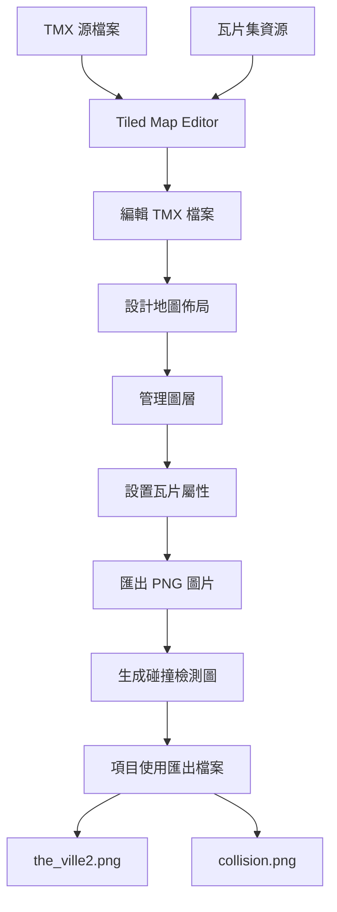

# Tiled Map Editor 使用指南

本文檔專門說明如何使用 Tiled Map Editor 來編輯生成式代理項目的地圖，包括安裝、配置、編輯和匯出的詳細步驟。

## 📥 安裝 Tiled Map Editor

### 下載和安裝
1. **官方網站**: https://www.mapeditor.org/
2. **支援平台**: Windows, macOS, Linux
3. **版本選擇**: 建議使用最新穩定版本
4. **安裝**: 按照標準安裝程序執行

### 驗證安裝
啟動 Tiled 後應該看到歡迎界面，可以選擇：
- 創建新地圖
- 打開現有地圖
- 查看最近檔案

## 🗺️ Tiled 在此項目中的角色



## 📂 項目文件關係

### 輸入檔案（Tiled 讀取）:
- `the_ville.tmx` - 主要編輯檔案
- `map_assets/` - 瓦片集圖片資源

### 輸出檔案（Tiled 生成）:
- `the_ville2.png` - 遊戲使用的主地圖
- `the_ville collision.png` - 碰撞檢測圖

## 🚀 開始編輯：逐步指南

### 步驟 1: 開啟專案檔案
```
檔案 → 開啟 → 選擇 the_ville.tmx
```

第一次開啟可能會提示找不到瓦片集，這是正常的。

### 步驟 2: 重新連結瓦片集
如果瓦片集遺失：
```
地圖 → 地圖屬性 → 瓦片集 → 瀏覽
```
選擇 `map_assets/` 資料夾中的相應圖片檔案。

### 步驟 3: 了解介面佈局

#### 主要區域：
- **左上**: 瓦片集面板（Tilesets）
- **中央**: 地圖編輯區域
- **右上**: 圖層面板（Layers）
- **右下**: 物件和屬性面板

#### 重要面板：
1. **瓦片集面板**: 顯示可用的瓦片
2. **圖層面板**: 管理不同圖層
3. **工具列**: 繪製、選擇、填充等工具

### 步驟 4: 圖層管理

#### 典型圖層結構（從下到上）:
```
🔹 Background          (背景地面)
🔹 Terrain             (地形特徵)
🔹 Buildings_Base      (建築基礎)
🔹 Buildings_Walls     (建築牆壁)
🔹 Decorations         (裝飾元素)
🔹 Objects             (互動物件)
🔹 Collision           (碰撞檢測層)
```

#### 圖層操作：
- **新增圖層**: 圖層面板右鍵 → 新增瓦片圖層
- **調整順序**: 拖曳圖層改變層級
- **顯示/隱藏**: 點擊圖層旁的眼睛圖示
- **鎖定圖層**: 避免意外編輯

### 步驟 5: 瓦片編輯技巧

#### 基本繪製工具：
- **筆刷工具** (B): 單個瓦片繪製
- **油漆桶** (G): 填充區域
- **矩形選擇** (R): 繪製矩形區域
- **橡皮擦** (E): 移除瓦片

#### 高級技巧：
- **Shift+拖曳**: 直線繪製
- **Ctrl+Z**: 復原操作
- **Ctrl+C/V**: 複製貼上選區
- **右鍵拖曳**: 快速選取瓦片

### 步驟 6: 碰撞檢測設置

#### 創建碰撞圖層：
1. 新增瓦片圖層，命名為 "Collision"
2. 使用特殊瓦片（通常是純色方塊）標記不可通行區域
3. 設置圖層透明度便於觀察（建議50%）

#### 碰撞檢測策略：
- **建築物內部**: 標記為不可通行
- **牆壁和障礙物**: 完全阻擋
- **裝飾物件**: 根據實際需求決定
- **水域**: 通常設為不可通行

### 步驟 7: 匯出設置

#### 主地圖匯出：
```
檔案 → 匯出為 → 圖片 (Export as Image)
```

#### 重要匯出設置：
- **檔案名稱**: `the_ville2.png`
- **包含隱藏圖層**: 取消勾選
- **包含背景色**: 建議勾選
- **解析度**: 保持100%（不縮放）

#### 碰撞圖匯出：
1. 隱藏所有圖層，只顯示 Collision 圖層
2. 匯出為 `the_ville collision.png`
3. 恢復其他圖層顯示

## 🎨 進階編輯技巧

### 瓦片集管理

#### 導入新瓦片集：
```
地圖 → 新增瓦片集 → 基於圖片的瓦片集
```

#### 瓦片屬性設置：
- 右鍵瓦片 → 瓦片屬性
- 可設置碰撞、動畫、自定義屬性等

### 自動瓦片（Auto-tiles）
- 設置地形轉換瓦片
- 自動選擇合適的邊界瓦片
- 提高大面積繪製效率

### 物件圖層
- 創建物件圖層標記特殊位置
- 設置出生點、傳送點等
- 添加自定義屬性

## 🔧 常見問題解決

### 問題 1: 瓦片集遺失
**解決方案**:
```
地圖 → 地圖屬性 → 瓦片集 → 重新指向正確檔案路徑
```

### 問題 2: 地圖尺寸不正確
**檢查**:
- 地圖 → 地圖屬性
- 確認寬度: 140格，高度: 100格
- 瓦片大小: 32x32像素

### 問題 3: 匯出圖片模糊
**解決方案**:
- 確保匯出時解析度設為100%
- 檢查原始瓦片圖片品質
- 避免使用插值縮放

### 問題 4: 圖層順序混亂
**解決方案**:
- 在圖層面板中重新排列圖層
- 使用合理的圖層命名
- 定期保存工作進度

## 📋 工作流程檢查清單

### 編輯前準備：
- [ ] 備份原始檔案
- [ ] 確認Tiled版本
- [ ] 準備瓦片資源

### 編輯過程：
- [ ] 正確設置地圖尺寸
- [ ] 合理安排圖層結構
- [ ] 設置碰撞檢測
- [ ] 定期保存進度

### 匯出檢查：
- [ ] 主地圖匯出正確
- [ ] 碰撞圖單獨匯出
- [ ] 檔案名稱正確
- [ ] 圖片尺寸符合預期

### 測試驗證：
- [ ] 前端顯示正常
- [ ] 代理移動正常
- [ ] 碰撞檢測有效

## 🔗 有用的快捷鍵

| 功能 | 快捷鍵 | 說明 |
|------|--------|------|
| 筆刷工具 | B | 單瓦片繪製 |
| 油漆桶 | G | 區域填充 |
| 矩形選擇 | R | 矩形繪製 |
| 橡皮擦 | E | 清除瓦片 |
| 縮放+ | Ctrl++ | 放大視圖 |
| 縮放- | Ctrl+- | 縮小視圖 |
| 復原 | Ctrl+Z | 取消操作 |
| 重做 | Ctrl+Y | 重複操作 |
| 網格顯示 | Ctrl+G | 切換網格 |

## 📚 學習資源

### 官方資源：
- **官方文檔**: https://doc.mapeditor.org/
- **教學視頻**: Tiled官方YouTube頻道
- **社群論壇**: https://discourse.mapeditor.org/

### 社群資源：
- **YouTube教學**: 搜索 "Tiled map editor tutorial"
- **遊戲開發論壇**: 如IndieDB、GameDev等
- **Reddit**: r/gamedev, r/indiegamedev

### 瓦片資源：
- **OpenGameArt**: https://opengameart.org/
- **Itch.io**: 免費和付費瓦片集
- **Kenney Assets**: 高品質免費遊戲資源

## ⚡ 效率提升建議

1. **預先規劃圖層結構** - 避免後期重新整理
2. **使用合理的瓦片集** - 不要過度複雜
3. **善用複製貼上** - 重複結構快速複製
4. **定期保存工作** - 避免意外損失
5. **測試小範圍修改** - 確保相容性

---

*本指南基於 Tiled Map Editor 1.9+ 版本編寫，更新於2025年1月8日。隨著軟體版本更新，部分介面可能略有差異，請參考最新官方文檔。*
